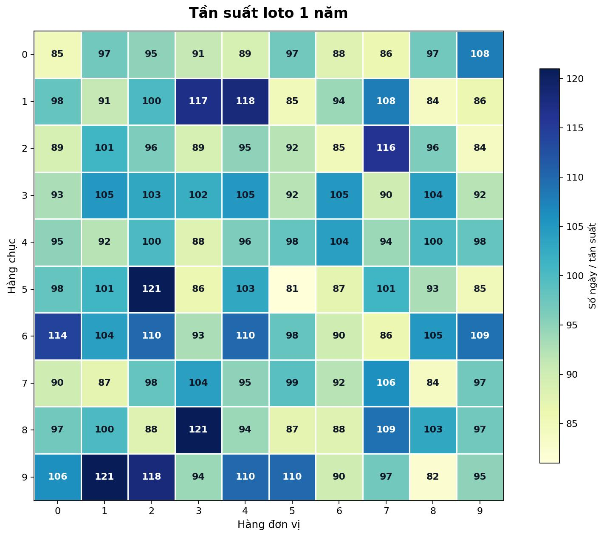
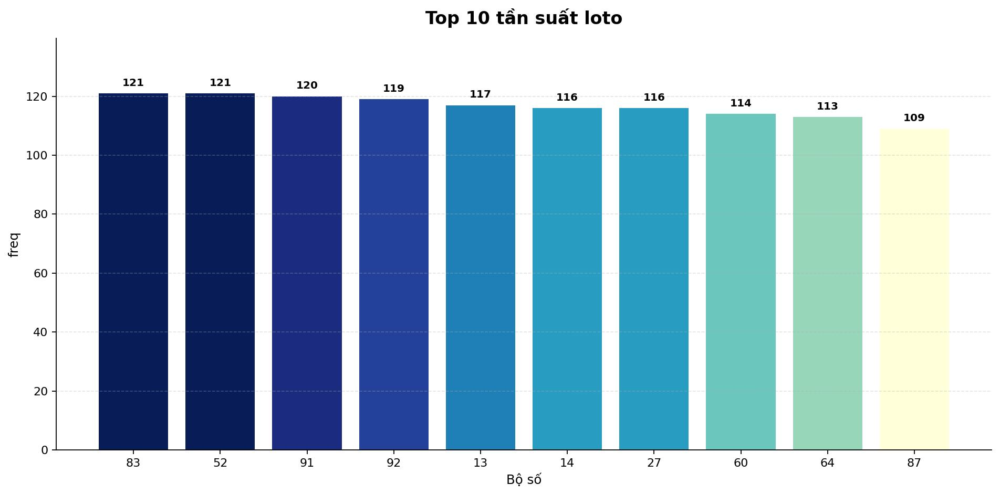
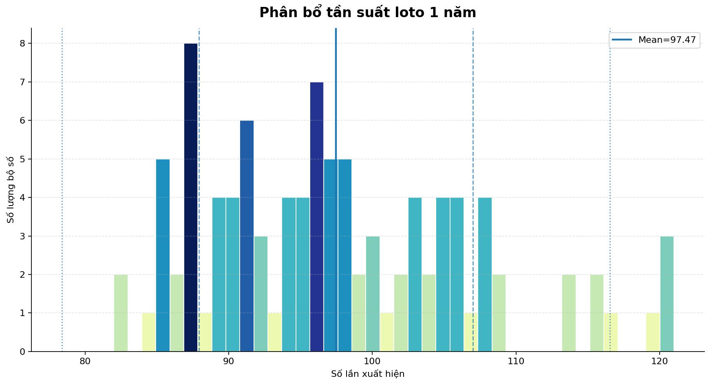

# Vietnam Lottery Analysis — GitHub-only Edition

Bộ mã nguồn **GitHub-only** để tự động thu thập dữ liệu XSMB, xây dựng thống kê, chạy AI/ML, đánh giá mô hình và xuất dashboard tĩnh bằng **GitHub Actions + GitHub Pages**. Không cần máy chủ riêng hay backend chạy thường trực.

> Mục đích của hệ thống là phân tích dữ liệu lịch sử và nghiên cứu xác suất. Kết quả AI/ML là tín hiệu thống kê, không bảo đảm kết quả tương lai.

## Latest data snapshot

<!-- SNAPSHOT:BEGIN -->
| Lottery (Xổ số) | Loto (Lô tô) |
| :------------: | :----------: |
| <table><tr><td>Date (Ngày)</td><td>01-09-2026</td></tr><tr><td>Special (Đặc biệt)</td><td>05521</td></tr><tr><td>First (Giải nhất)</td><td>69764</td></tr><tr><td>Second (Giải nhì)</td><td>11984, 25698</td></tr><tr><td>Third (Giải ba)</td><td>24697, 76719, 65670, 08302, 47610, 85931</td></tr><tr><td>Fourth (Giải tư)</td><td>9017, 8080, 3768, 3944</td></tr><tr><td>Fifth (Giải năm)</td><td>6796, 9705, 8662, 2052, 6112, 5873</td></tr><tr><td>Sixth (Giải sáu)</td><td>874, 177, 239</td></tr><tr><td>Seventh (Giải bảy)</td><td>63, 93, 51, 68</td></tr></table> | <table><tr><td>First (Đầu)</td><td>Last (Đuôi)</td></tr><tr><td>0</td><td>2, 5</td></tr><tr><td>1</td><td>9, 0, 7, 2</td></tr><tr><td>2</td><td>1</td></tr><tr><td>3</td><td>1, 9</td></tr><tr><td>4</td><td>4</td></tr><tr><td>5</td><td>2, 1</td></tr><tr><td>6</td><td>4, 8, 2, 3, 8</td></tr><tr><td>7</td><td>0, 3, 4, 7</td></tr><tr><td>8</td><td>4, 0</td></tr><tr><td>9</td><td>8, 7, 6, 3</td></tr></table> |
<!-- SNAPSHOT:END -->

<!-- FUN_PREDICTION:BEGIN -->
## 🎲 Dự đoán vui ngày 02-09-2026

> **Anchor:** kết quả thực đến **01-09-2026**. **Không phải kết quả thật.** Dự đoán vui/mô phỏng để tham khảo. Mô hình chỉ ước lượng xác suất 2 số cuối; các chữ số tiền tố trong bảng giải đầy đủ là số tổng hợp deterministic, không phải xác suất dự đoán giải 3–5 chữ số và không bảo đảm kết quả thực tế.

### Bảng mô phỏng đầy đủ

| Giải | Dự đoán vui |
|---|---|
| Đặc biệt | `29635` |
| Giải nhất | `95698` |
| Giải nhì | `13361` · `24465` |
| Giải ba | `21860` · `44991` · `36518` · `68608` · `05730` · `95795` |
| Giải tư | `1686` · `3555` · `5447` · `8703` |
| Giải năm | `9129` · `6882` · `8197` · `8494` · `3806` · `2579` |
| Giải sáu | `704` · `482` · `708` |
| Giải bảy | `93` · `78` · `45` · `83` |

### Top Loto ngày mai

| # | Số | Xác suất model |
|---:|:---:|---:|
| 1 | **95** | **24.36%** |
| 2 | **83** | **24.36%** |
| 3 | **69** | **24.34%** |
| 4 | **77** | **24.16%** |
| 5 | **17** | **24.09%** |
| 6 | **36** | **24.07%** |
| 7 | **54** | **24.05%** |
| 8 | **50** | **23.96%** |
| 9 | **35** | **23.95%** |
| 10 | **52** | **23.94%** |

### Top Đặc biệt ngày mai

| # | Số | Xác suất model |
|---:|:---:|---:|
| 1 | **83** | **1.198%** |
| 2 | **54** | **1.195%** |
| 3 | **38** | **1.175%** |
| 4 | **68** | **1.164%** |
| 5 | **43** | **1.139%** |
| 6 | **21** | **1.108%** |
| 7 | **23** | **1.107%** |
| 8 | **28** | **1.102%** |
| 9 | **39** | **1.101%** |
| 10 | **67** | **1.078%** |

> Xác suất ở bảng Loto là xác suất model cho số 00–99 xuất hiện trong kỳ; xác suất ĐB là distribution riêng cho 2 số cuối giải đặc biệt. Các chữ số tiền tố trong bảng mô phỏng đầy đủ được sinh deterministic để tạo bảng vui, không phải dự báo xác suất cho toàn bộ số 3–5 chữ số.
<!-- FUN_PREDICTION:END -->

## Kiến trúc production

### Nguồn dữ liệu theo thứ tự ưu tiên

1. `xoso.com.vn`
2. `mketqua.net`
3. `www.minhngoc.net.vn`
4. `xosominhngoc.com`
5. `xosodaiphat.com`
6. `hainhay.net`

Kết quả mới không được ghi thẳng vào lịch sử chỉ vì một website đã hiển thị. Với kỳ quay gần nhất, hệ thống chuẩn hóa đúng độ dài từng giải, đối chiếu toàn bộ 27 giá trị và yêu cầu **ít nhất 2 provider group độc lập** đồng thuận. Hai domain Minh Ngọc được coi là cùng một provider group để tránh đếm mirror như hai xác nhận độc lập.

Dữ liệu live là provisional và được giữ tách biệt khỏi canonical history cho tới khi đủ consensus.

## Chức năng chính

- Multi-source collection, retry, source audit và data-health gate.
- Near-live XSMB bằng GitHub Actions: 6 nguồn được fetch song song, merge từng ô giải và cập nhật JSON live khi payload thay đổi.
- Strict parser: không zero-fill placeholder hoặc số đang quay chưa đủ độ dài.
- Thống kê tần suất, gan, chu kỳ, nháy, đầu/đuôi/tổng, chạm, cặp lộn, lô rơi, ma trận ngày/tuần/tháng/năm.
- Kiểm định thống kê với Bayesian shrinkage, credible interval, multiple-testing control/FDR và diagnostics về entropy/drift.
- Empirical-Bayes signal độc lập: exponential decay, weekday posterior, multi-window stability và shrinkage về baseline khi tín hiệu không ổn định.
- Path/cầu engine theo vị trí chữ số, active/stable streak, walk-forward backtest và explainable position evidence.
- Base ML với temporal feature engineering: target weekday, EWM 14/45, rolling 7/30/90/365, trend, gap/streak, reverse-number dynamics và vectorized path support.
- Temporal model selection 4 tầng: train → natural-prevalence calibration → model-selection → untouched validation.
- `HistGradientBoostingClassifier` + Platt calibration + recency weighting; model yếu được shrink về historical baseline thay vì phát xác suất quá tự tin.
- Cầu-kèo ML + position evidence.
- Ensemble 5 thành phần: base ML + cầu-kèo ML + statistical Bayes + active path + stable path; trọng số học bằng walk-forward LogLoss với regularization.
- Model disagreement/uncertainty tier, rolling LogLoss/Brier và compact prediction history.
- Dashboard responsive trong `docs/`, triển khai trực tiếp bằng GitHub Pages Actions.
- Excel-safe exports giữ số 0 ở đầu.

## Cài đặt mới hoàn toàn trên GitHub

### 1. Tạo repository

Tạo repository GitHub mới và upload **toàn bộ nội dung package vào root repository**.

Khuyến nghị repository private trong giai đoạn thử nghiệm; khi Pages/public access đã đúng mới đổi visibility nếu cần.

### 2. Cho phép GitHub Actions ghi dữ liệu

Vào:

`Settings → Actions → General → Workflow permissions`

Chọn:

`Read and write permissions`

rồi Save.

### 3. Bật GitHub Pages bằng GitHub Actions

Vào:

`Settings → Pages → Build and deployment`

Chọn:

`Source: GitHub Actions`

Không chọn `Deploy from a branch`; package đã có workflow Pages chính thức trong `.github/workflows/pages.yml`.

### 4. Chạy finalization lần đầu

Vào:

`Actions → Finalize XSMB + Statistics + AI/ML → Run workflow`

Lần chạy đầu sẽ:

1. Load lịch sử đã commit.
2. Đồng bộ ngày thiếu từ 6 nguồn.
3. Chỉ promote kết quả mới khi vượt validation/consensus gate.
4. Chạy thống kê và kiểm định.
5. Refit path/cầu.
6. Retrain base ML nếu có draw mới hoặc feature schema thay đổi.
7. Chạy cầu-kèo ML và empirical-Bayes signal.
8. Ghi prediction history và cập nhật labels.
9. Học ensemble weights/calibration khi history đủ trưởng thành.
10. Build dashboard.
11. Commit `data/`, `models/`, `images/`, `docs/`, `README.md`.
12. Deploy `docs/` trực tiếp lên GitHub Pages.

Không cần GitHub Secret trong cấu hình mặc định.

## Live XSMB

Workflow:

`Near-live XSMB results`

được schedule lúc **18:04 Asia/Ho_Chi_Minh**. Một runner giữ sống trong cửa sổ quay và poll khoảng **25 giây/lần**. Mỗi snapshot fetch 6 nguồn song song; chỉ thay đổi payload mới được force-publish thành `live/live.json` trên branch `live`.

`docs/live.html` đọc JSON raw từ branch `live`, vì vậy không phải rebuild toàn bộ GitHub Pages cho mỗi lần có thêm một giải.

Các trạng thái live:

- `waiting`: chưa có giá trị.
- `live`: đang có kết quả từng phần.
- `complete_provisional`: đủ 27 giá trị nhưng chưa đủ independent consensus.
- `complete_conflict`: đủ nhưng các nguồn còn xung đột.
- `complete_verified`: toàn bộ 27 slot đã được xác minh; live job có thể dừng.

Nếu repository dùng branch-protection, **không áp dụng rule cấm force-push cho branch `live`**, hoặc loại branch này khỏi rule. `main` không bị force-push.

> GitHub scheduled workflows có thể bị platform delay. Vì vậy GitHub-only không thể cam kết wall-clock realtime như một server luôn chạy. Thiết kế này giảm rủi ro bằng cách mở live job trước giờ quay, polling bên trong job và có nhiều mốc finalization/recovery sau quay.

<!-- AUTOMATION:BEGIN -->
## ⚙️ Zero-touch automation

Hệ thống vận hành tự động bằng GitHub Actions; không cần chạy cron/VPS bên ngoài trong cấu hình mặc định.

| Lớp tự động | Giờ Việt Nam | Hành vi |
|---|---|---|
| Near-live chính | **18:04** | Mở cửa sổ live, poll khoảng 25 giây/lần và kiểm chứng nhiều nguồn. |
| Live watchdog | **18:10, 18:20** | Nếu live chưa có heartbeat của ngày hiện tại, tự dispatch lại live workflow. |
| Daily finalization | **18:18, 18:28, 18:38, 18:48, 18:58, 19:13, 19:28** | Poll/fetch, yêu cầu ≥2 provider group độc lập, commit canonical trước rồi mới chạy Statistics + AI/ML + prediction + README + Pages. |
| Canonical recovery | **19:35, 20:05** | Nếu canonical còn stale hoặc artifact audit fail, tự dispatch lại daily finalization. |
| Pages recovery | **20:20** | Retry deploy Pages độc lập khi canonical đã ổn. |
| Overnight safety net | **07:15** | Kiểm tra lại canonical, prediction, README, model artifacts, dashboards và live reconciliation. |
| Post-finalization | Sau mỗi daily success | Full production audit và đồng bộ branch `live` về đúng canonical `complete_verified`. |

Recovery workflows kiểm tra trạng thái trước khi dispatch để tránh tạo job trùng khi workflow mục tiêu đang `queued/in_progress`. Daily canonical commit vẫn độc lập với Pages/watchdog, nên lỗi dashboard hoặc hậu kiểm không giữ lại kết quả daily đã xác minh.

> GitHub scheduled workflows là best-effort và nguồn dữ liệu bên thứ ba có thể thay đổi/gián đoạn. Watchdog + nhiều recovery slots giúp hệ thống tự phục hồi tối đa trong giới hạn kiến trúc GitHub-only, nhưng không thể tạo SLA tuyệt đối như một scheduler/server chuyên dụng.
<!-- AUTOMATION:END -->

## Dashboard

- `docs/index.html` — landing/dashboard chính.
- `docs/live.html` — near-live results và source verification.
- `docs/statistics.html` — thống kê/ma trận nâng cao.
- `docs/dashboard.html` — AI/ML ensemble dashboard.
- `docs/model-quality.html` — rolling LogLoss/Brier.
- `docs/ml_top10_loto.html`, `docs/ml_top10_de.html`.
- `docs/soi-path-loto-active.html`, `docs/soi-path-loto-stable.html`.
- `docs/soi-path-de-active.html`, `docs/soi-path-de-stable.html`.

## Data outputs

| Dataset | CSV | JSON | Excel-safe XLSX |
|---|---|---|---|
| Raw | `data/xsmb.csv` | `data/xsmb.json` | `data/excel/xsmb.xlsx` |
| 2 digits | `data/xsmb-2-digits.csv` | `data/xsmb-2-digits.json` | `data/excel/xsmb-2-digits.xlsx` |
| Sparse 00–99 | `data/xsmb-sparse.csv` | `data/xsmb-sparse.json` | `data/excel/xsmb-sparse.xlsx` |

Derived outputs:

- `data/source_audit.json` — provenance/consensus gần đây.
- `data/advanced/` — thống kê nâng cao.
- `data/significance/` — kiểm định/FDR/diagnostics.
- `data/statistical_signal/` — empirical-Bayes component.
- `data/path_ui/` — active/stable path outputs.
- `data/ai_ml/` — cầu-kèo ML/evidence.
- `data/ml/` — calibrated base-ML probabilities.
- `data/ensemble/` — learned ensemble weights/calibration.
- `data/predict/` — final ensemble probabilities/picks.
- `data/history/` — compact walk-forward component history.
- `data/prob_eval/` — rolling model-quality metrics.
- `models/` — trained model artifacts + train reports.

## Thống kê 1 năm hiện tại

- Max frequency: **123.0**
- Min frequency: **81.0**
- Mean: **98.55**
- Standard deviation: **10.49**







## Kiểm tra chất lượng code

CI chạy khi push/pull request. Có thể nghiệm thu tương đương trên máy phát triển:

```bash
python -m pip install -r requirements-dev.txt
bash scripts/release_check.sh
```

Release check kiểm tra syntax/lint, unit tests, source policy, training/prediction smoke, thống kê Bayes, data integrity và các output bắt buộc từ dữ liệu đã commit.

## Cấu trúc repository

```text
.github/workflows/      CI, live, daily finalization, Pages deployment
src/                    sources, validation, statistics, AI/ML, dashboard builders
src/templates/          generated README/template assets
tests/                  regression + data/source/ML tests
data/                   canonical + analytical outputs
models/                 trained model artifacts
images/                 generated visualizations
docs/                   GitHub Pages static website
scripts/release_check.sh
requirements*.txt
README.md
```

## Ghi chú về xác suất

Xổ số là quá trình ngẫu nhiên; thêm nhiều thuật toán không biến dữ liệu lịch sử thành bảo đảm dự đoán. Hệ thống ưu tiên calibration, out-of-sample validation, shrinkage và model disagreement để **giảm overfitting và overconfidence**, thay vì phóng đại tín hiệu yếu.

## License

Xem `LICENSE` trong repository.