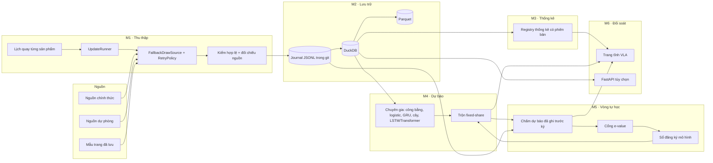

# Phân hệ Vietlott — yêu cầu kỹ thuật và kiến trúc

Ngày 08-10-2026. Tài liệu trả lời sáu nhóm yêu cầu của chủ dự án: thu thập realtime,
kho dữ liệu, thống kê, dự báo AI, vòng tự học, bảng đối soát. Nó gồm bốn phần: kiến
trúc, công nghệ, lược đồ dữ liệu, lộ trình.

Nguyên tắc viết: **mọi đề xuất neo vào mã đang có.** Engine `vietlott/` (chép từ VLM
ngày 07-10-2026) đã hiện thực phần lớn yêu cầu. Thiết kế lại từ đầu sẽ vứt đi những thứ
đã được kiểm chứng. Vì vậy mỗi yêu cầu đều được đối chiếu với module cụ thể, và chỉ phần
còn thiếu mới được đưa vào lộ trình.

## 0. Ranh giới phải nói trước

Hai yêu cầu cần được diễn đạt lại thì mới làm được một cách trung thực.

**"Nâng cao xác suất dự đoán cho các kỳ sau" (yêu cầu 5).** Nếu máy quay công bằng, xác
suất trúng của mọi bộ số bằng nhau và **không mô hình nào tăng được nó**. Mega 6/45 là
1/8 145 060, Power 6/55 là 1/28 989 675. Vòng tự học vì thế có hai việc làm được:

1. Phát hiện độ lệch THẬT nếu máy quay có, và chứng minh nó bằng kiểm định hợp lệ. Max 3D
   là ví dụ đã đo được: số 6 ở hàng đơn vị chiếm khoảng 11% thay vì 10%
   (`documentation/research/2026-10-07-max3d-hang-don-vi.md`).
2. Khi không có độ lệch, tự trả trọng số về luật công bằng. Như vậy hệ thống không bao
   giờ quảng cáo một lợi thế không tồn tại.

Thước đo của vòng tự học là **log-loss so với luật công bằng** và **e-value tích lũy**.
"Số trùng nhiều hơn kỳ trước" không phải thước đo, vì nó dao động ngẫu nhiên.

**"Confidence score" (yêu cầu 4).** Một con số kiểu "tin cậy 87%" đặt cạnh một bộ số sẽ bị
đọc thành "87% sẽ trúng", và điều đó sai. Kho này từng mắc đúng lỗi ấy với hậu nghiệm
thô (CLAUDE.md, phần Độ tin cậy dự báo). Đầu ra của engine vì thế gồm hai phần tách bạch:

- **Phân phối xác suất** đầy đủ, kèm hệ số lệch so với ngẫu nhiên (`lift`, ví dụ ×1,07).
- **Trạng thái kiểm định:** e-value, số kỳ đã chấm, p-value hợp lệ ở mọi thời điểm, đạt
  hay chưa đạt cổng.

Hai phần này không được gộp thành một phần trăm.

## 1. Đối chiếu yêu cầu với mã hiện có

| # | Yêu cầu | Đã có (module) | Còn thiếu |
|---|---|---|---|
| 1 | Crawler realtime, retry, xử lý đổi cấu trúc, polling theo lịch | `vlm.updates.schedule` (cửa sổ từng sản phẩm, 2 phút trong giờ quay), `vlm.updates.runner`, `crawler.http.RetryPolicy` (backoff mũ + jitter, `Retry-After`, nhận diện Cloudflare), `crawler.sources.fallback` (chuỗi nguồn dự phòng, ghi từng lần thử), `crawler.schemas` + `saved_pages` (mẫu trang đã lưu) | Trang VLA dựng theo cron 5 lần/ngày chứ không theo sự kiện; chưa có cảnh báo "trễ quá X giờ" (hiện lượt nào thiếu một sản phẩm là đỏ); chưa có canary đổi cấu trúc chạy định kỳ |
| 2 | Kho lịch sử tối ưu chuỗi thời gian, metadata đủ | Journal `data/results/results.jsonl` (append-only, commit vào git), DuckDB `draws`/`prizes`/`sync_log`, Parquet, seed 8 sản phẩm, `vlm.database.schema` (Pydantic + SQLAlchemy, không ghi đè kết quả mâu thuẫn) | Chưa có lược đồ chuẩn hóa cho dự báo, phiên bản mô hình, backtest; bảng giải lưu dạng chuỗi JSON (`tier_winners VARCHAR`) |
| 3 | Thống kê: tần suất, co-occurrence, nóng/lạnh, gap; tinh chỉnh được | `analytics.stats` (GOF, BH-FDR, Wilson), `analytics.cooccurrence` (null Monte Carlo + FDR), `analytics.gaps` (hazard), `analytics.randomness` (χ², entropy, runs, Ljung-Box), `inference.*` (tuần tự, changepoint, đa kiểm, công suất) | Chưa có registry cho thuật toán tự viết, chưa đánh phiên bản thống kê, chưa có quy trình đăng ký giả thuyết tiến cứu cho Vietlott |
| 4 | AI dự báo, phân phối xác suất | `vietlott_engine.forecast` (hỗn hợp chuyên gia, e-process theo sản phẩm), `vlm.forecast` (logistic AdaGrad, GRU NumPy BPTT, RF/XGB/LGB, trộn fixed-share), liệt kê top-N chính xác, RTP từng cửa | Chưa có LSTM/Transformer; chưa có hợp đồng đầu ra chung cho mọi mô hình |
| 5 | Tự học sau mỗi kỳ, tự chỉnh trọng số | Học online sau mỗi kỳ, trọng số fixed-share theo log-likelihood, checkpoint JSON gzip có hash lịch sử, cổng live (e-value ≥ 140, ≥ 100 kỳ live, log-score gần đây dương) | Chưa có sổ đăng ký mô hình (shadow → challenger → production), chưa tự rollback khi kỹ năng rơi, chưa theo dõi trôi dạng `skill_monitor` |
| 6 | Bảng đối soát, Hit Rate/Precision/Recall, backtest | Sổ dự báo ghi TRƯỚC kỳ (`ledger.jsonl`, `ml-ledger.jsonl`), trang đối chiếu trên site, `backtest.engine.WalkForwardBacktester` (SPA Hansen, White Reality Check, Holm, TOST), job Docker `backtest` | Trang chưa in số trùng so với kỳ vọng ngẫu nhiên kèm khoảng tin cậy, chưa tách theo phiên bản mô hình, chưa có trang backtest |

## 2. Kiến trúc tổng thể

### 2.1 Các tầng



### 2.2 Luồng một kỳ quay (đường găng)

1. **Lên lịch.** `vlm.updates.schedule` biết cửa sổ quay của từng sản phẩm (Mega 18:00 thứ
   4, 6, CN; Lotto 13:00 và 21:00; Keno 06:00–22:15 …), theo giờ Việt Nam và không
   phụ thuộc múi giờ máy. Trong cửa sổ thì thử mỗi 2 phút, ngoài cửa sổ thì mỗi giờ.
2. **Lấy kết quả.** `FallbackDrawSource` thử lần lượt từng nguồn; mỗi nguồn đi qua
   `RetryPolicy` (backoff mũ có jitter, tôn trọng `Retry-After`). Lần thử nào cũng được
   ghi (nguồn, lỗi, số dòng), nên biết được dữ liệu đến từ đâu.
3. **Kiểm hợp lệ.**
   - Lược đồ Pydantic chặn kết quả sai luật: số ngoài miền, trùng số, sai số lượng.
   - Kết quả mâu thuẫn với bản đã lưu KHÔNG được ghi đè, mà bị đánh dấu xung đột.
   - Bản ghi chỉ có ngày thì mang `time_precision=day`, không giả giờ quay.
4. **Lưu.** Ghi journal trước (nguồn sự thật, ai cũng kiểm toán được qua git), rồi
   upsert DuckDB, rồi xuất Parquet.
5. **Chấm.** Mọi dự báo đã ghi TRƯỚC giờ quay của kỳ này được chấm: log-loss, log-loss
   của luật công bằng, số trùng, cập nhật e-value. Dự báo ghi sau giờ quay không được
   tính vào bằng chứng.
6. **Học.** Các chuyên gia cập nhật online; trọng số trộn cập nhật theo log-likelihood
   thật. Cây quyết định được fit lại định kỳ trên một vùng đệm giới hạn.
7. **Dự báo kỳ tới.** Engine phát luật xác suất cho kỳ tới và ghi sổ kèm `history_sha256`
   cùng thời điểm phát. Nếu chưa qua cổng, luật công bố là luật công bằng; luật của mô
   hình được ghi rõ là thử nghiệm.
8. **Xuất bản.** Dựng 8 trang Vietlott qua `page_output.write_page` rồi triển khai Pages.

### 2.3 Vì sao "webhook" là polling

Theo những gì đã biết, nguồn kết quả không có webhook công khai, nên chiều vào chỉ có
thể là polling theo lịch. Webhook hợp lý ở **chiều ra**: khi M1 lưu được kết quả mới, nó
phát sự kiện `draw.ingested` để các bước sau chạy ngay thay vì chờ cron.

- **Trên GitHub Actions:** dùng `workflow_run` hoặc `repository_dispatch`. Sự kiện đẩy code
  bằng `GITHUB_TOKEN` không kích hoạt workflow khác, nhưng hai trigger này thì có.
- **Ở chế độ máy chủ thường trực:** FastAPI gọi trực tiếp hàm học và dựng trang.

### 2.4 Hai chế độ vận hành

| | Chế độ A — tĩnh (đang chạy) | Chế độ B — máy chủ thường trực (tùy chọn) |
|---|---|---|
| Thu thập | `vlm-results.yml` mỗi 10 phút ban ngày, mỗi giờ ban đêm | API Docker, kiểm tra mỗi 2 phút trong cửa sổ quay |
| Độ trễ thực tế | 10–40 phút (cron GitHub có thể bị hoãn) | khoảng 2–5 phút sau khi nguồn công bố |
| Lưu trữ | Journal trong git + cache DuckDB | Volume Docker `vqe-data` |
| Hiển thị | Trang tĩnh trên GitHub Pages | Trang tĩnh, cộng API `/forecast`, `/updates/status` |
| Chi phí | 0 | Một VPS nhỏ (1 vCPU, 1–2 GB RAM) |

"Realtime" theo nghĩa vài phút chỉ đạt được ở chế độ B. Việc có thuê máy chủ hay không là
quyết định của chủ dự án. Chế độ A vẫn đúng dữ liệu, chỉ chậm hơn. Bước 1 của lộ trình rút
độ trễ ở chế độ A bằng cách dựng trang theo sự kiện.

## 3. Đề xuất công nghệ

Ràng buộc của kho quyết định một nửa lựa chọn (CLAUDE.md):
- trang tĩnh trên GitHub Pages;
- CSS viết tay, không framework JS;
- dựng DOM bằng `createElement`, không gán chuỗi HTML;
- không in tên nguồn dữ liệu ra trang.

| Tầng | Chọn | Lý do | Không chọn, và vì sao |
|---|---|---|---|
| Crawler | Python 3.11+, `httpx` bất đồng bộ, `curl_cffi` (vân tay TLS trình duyệt), BeautifulSoup/lxml | Đang chạy và có kiểm thử; `RetryPolicy` và chuỗi dự phòng đã viết | Scrapy (nặng cho vài trang/kỳ), Playwright (chỉ để dành khi nguồn bắt buộc JS) |
| Lịch | `vlm.updates` (chế độ B), cron GitHub Actions (chế độ A) | Lịch theo từng sản phẩm, chạy lại an toàn | Celery/Airflow: quá tải cho 8 sản phẩm |
| Lưu trữ | Journal JSONL trong git + DuckDB + Parquet | Dữ liệu nhỏ: Keno 297 398 kỳ × 20 số khoảng 6 triệu giá trị, nằm gọn trong RAM. DuckDB cột hóa, truy vấn cửa sổ thời gian nhanh, nhúng được, không cần dịch vụ riêng. Journal trong git cho phép kiểm toán và khôi phục khi mất cache | TimescaleDB/PostgreSQL: chỉ cần khi có nhiều tiến trình cùng ghi ở chế độ B. Engine đã có extra `postgres` để chuyển khi cần |
| Thống kê | NumPy, SciPy, `vietlott_engine.analytics` / `inference` | Đã có null Monte Carlo, FDR, kiểm định tuần tự | — |
| ML | NumPy (GRU, logistic online), scikit-learn, XGBoost, LightGBM (extra `ml`) | Đang chạy, checkpoint JSON (không dùng pickle) | — |
| Deep learning | PyTorch CPU, extra `[deep]` tùy chọn | LSTM/Transformer làm **chuyên gia thách đấu** trong hỗn hợp fixed-share; không cần GPU vì mô hình nhỏ | TensorFlow (nặng, không thêm gì); GPU (không đáng với lượng dữ liệu này) |
| Sổ mô hình | Checkpoint JSON + bảng `model_version` + sổ dự báo append-only | Đủ để truy vết: mã, cấu hình, hash lịch sử | MLflow: thêm một dịch vụ mà không thêm bằng chứng |
| Backend | FastAPI + Uvicorn **1 worker** (chế độ B) | Đã có router; DuckDB chỉ cho một tiến trình ghi | Nhiều worker (đã chặn trong CLI) |
| Frontend | HTML tĩnh qua `page_output.write_page`, CSS tay, JS thuần, biểu đồ SVG dựng sẵn bằng Python, dữ liệu JSON tại `docs/data/vietlott/` | Đúng luật của kho; nhanh; không cần build | React/Tailwind/Chart.js: trái CLAUDE.md |
| Kiểm thử | pytest (369 phép của engine + bộ VLA), kiểm thử đột biến, mẫu trang đã lưu | Kỷ luật kiểm thử của kho | — |

## 4. Lược đồ dữ liệu

Lược đồ dưới đây dùng kiểu của DuckDB và chạy được trên PostgreSQL với thay đổi nhỏ. Nó
**không thay thế ngay** các bảng `draws`/`prizes`/`sync_log` đang chạy. Bước 2 của lộ
trình dựng nó thành bảng mới cùng view tương thích, rồi chuyển dần từng nơi đọc.

### 4.1 Danh mục và kết quả

```sql
-- Luật của từng sản phẩm: một chỗ khai báo, mọi module đọc từ đây.
CREATE TABLE game (
    code            VARCHAR PRIMARY KEY,          -- mega645, power655, lotto535, max3d, max3dpro, keno, bingo18, max4d
    kind            VARCHAR NOT NULL CHECK (kind IN ('set', 'digit', 'dice')),
    pool_n          SMALLINT,                     -- 45, 55, 35, 80; NULL cho loại chữ số
    pick_k          SMALLINT NOT NULL,            -- 6, 6, 5, 20, 3, ...
    digit_width     SMALLINT,                     -- 3 cho Max 3D, 4 cho Max 4D
    bonus_rule      VARCHAR,                      -- 'same_drum' (Power), 'separate_1_12' (Lotto), NULL
    schedule        JSON NOT NULL,                -- cửa sổ quay theo giờ VN
    active          BOOLEAN NOT NULL DEFAULT TRUE
);

-- Một dòng cho mỗi kỳ ĐÃ XÁC THỰC. Khóa tự nhiên (game, draw_id).
CREATE TABLE draw (
    game            VARCHAR  NOT NULL REFERENCES game(code),
    draw_id         INTEGER  NOT NULL,
    draw_ts         TIMESTAMPTZ NOT NULL,         -- giờ quay; 00:00 nếu chỉ biết ngày
    time_precision  VARCHAR  NOT NULL CHECK (time_precision IN ('minute', 'day')),
    numbers         SMALLINT[] NOT NULL,          -- theo thứ tự quay nếu biết, nếu không thì đã sắp
    numbers_ordered BOOLEAN  NOT NULL,            -- TRUE khi giữ được thứ tự quay
    bonus           SMALLINT,
    status          VARCHAR  NOT NULL CHECK (status IN ('validated', 'conflict')),
    journal_sha256  VARCHAR  NOT NULL,            -- hash dòng journal sinh ra bản ghi
    first_seen_at   TIMESTAMPTZ NOT NULL,         -- dùng để đo độ trễ thu thập
    PRIMARY KEY (game, draw_id)
);
CREATE INDEX draw_by_time ON draw (game, draw_ts);

-- Mỗi nguồn nhìn thấy gì: phát hiện mâu thuẫn mà không ghi đè.
CREATE TABLE draw_observation (
    game            VARCHAR NOT NULL,
    draw_id         INTEGER NOT NULL,
    source_code     VARCHAR NOT NULL,             -- mã ẩn danh, KHÔNG phải tên miền
    observed_at     TIMESTAMPTZ NOT NULL,
    numbers         SMALLINT[] NOT NULL,
    bonus           SMALLINT,
    raw_sha256      VARCHAR NOT NULL,             -- hash nội dung trang/JSON gốc
    agrees          BOOLEAN NOT NULL,             -- trùng bản đã xác thực?
    PRIMARY KEY (game, draw_id, source_code, observed_at)
);
```

### 4.2 Giải thưởng và jackpot

```sql
-- Bảng giải theo ĐÚNG mã kỳ; khuyết thì không có dòng (trang in "—"), không mượn kỳ trước.
CREATE TABLE prize_tier (
    game            VARCHAR NOT NULL,
    draw_id         INTEGER NOT NULL,
    tier_code       VARCHAR NOT NULL,             -- jackpot1, jackpot2, first, second, ...
    condition       VARCHAR NOT NULL,             -- "6 số chính", "5 số + số đặc biệt"
    value_vnd       BIGINT,                       -- NULL = chưa công bố
    winners         INTEGER,                      -- NULL = chưa công bố
    is_pool         BOOLEAN NOT NULL,             -- giải chia theo quỹ (jackpot)
    PRIMARY KEY (game, draw_id, tier_code),
    FOREIGN KEY (game, draw_id) REFERENCES draw(game, draw_id)
);

-- Giá trị jackpot TRƯỚC kỳ quay: cần để tính RTP và kỳ vọng thật của vé.
CREATE TABLE jackpot_snapshot (
    game            VARCHAR NOT NULL,
    draw_id         INTEGER NOT NULL,
    pot_code        VARCHAR NOT NULL,             -- jackpot1, jackpot2
    value_vnd       BIGINT  NOT NULL,
    rolled_over     BOOLEAN,                      -- kỳ trước không ai trúng
    PRIMARY KEY (game, draw_id, pot_code)
);
```

### 4.3 Vận hành thu thập

```sql
CREATE TABLE ingestion_run (
    run_id          VARCHAR PRIMARY KEY,
    trigger         VARCHAR NOT NULL CHECK (trigger IN ('schedule', 'api', 'manual', 'replay')),
    started_at      TIMESTAMPTZ NOT NULL,
    finished_at     TIMESTAMPTZ,
    status          VARCHAR NOT NULL CHECK (status IN ('ok', 'partial', 'failed'))
);

CREATE TABLE source_attempt (
    run_id          VARCHAR NOT NULL REFERENCES ingestion_run(run_id),
    game            VARCHAR NOT NULL,
    source_code     VARCHAR NOT NULL,
    ok              BOOLEAN NOT NULL,
    rows_fetched    INTEGER,
    rows_inserted   INTEGER,
    rows_rejected   INTEGER,
    error_class     VARCHAR,                      -- timeout, http_5xx, cloudflare, parse_schema, no_newer
    http_status     SMALLINT,
    latency_ms      INTEGER,
    PRIMARY KEY (run_id, game, source_code)
);
```

`error_class = 'parse_schema'` trên một nguồn vốn ổn định là tín hiệu **nguồn đổi cấu
trúc**. Cảnh báo nên dựa vào nó và vào độ trễ (`now() − draw_ts` của kỳ đến hạn), chứ không
dựa vào việc một lượt chạy đỏ.

### 4.4 Thống kê có phiên bản

```sql
CREATE TABLE stat_definition (
    stat_code       VARCHAR NOT NULL,             -- frequency, cooccurrence, gap_hazard, ...
    version         INTEGER NOT NULL,             -- tăng khi định nghĩa đổi (như STAT_VERSION)
    params          JSON    NOT NULL,             -- cửa sổ, hệ số suy giảm, số mô phỏng null
    null_model      VARCHAR NOT NULL,             -- mô tả phép so: Monte Carlo, hypergeometric, ...
    PRIMARY KEY (stat_code, version)
);

CREATE TABLE stat_snapshot (
    game            VARCHAR NOT NULL,
    stat_code       VARCHAR NOT NULL,
    version         INTEGER NOT NULL,
    as_of_draw_id   INTEGER NOT NULL,             -- chỉ dùng dữ liệu tới kỳ này
    payload         JSON    NOT NULL,             -- giá trị + p/q-value so với null
    computed_at     TIMESTAMPTZ NOT NULL,
    PRIMARY KEY (game, stat_code, version, as_of_draw_id)
);

-- Giả thuyết TIẾN CỨU: tham số chốt trước khi có dữ liệu kiểm, như data/hypotheses/*.csv của XSMB.
CREATE TABLE hypothesis (
    hypothesis_id   VARCHAR PRIMARY KEY,          -- ví dụ max3d_units_6_2026_10
    game            VARCHAR NOT NULL,
    statement       VARCHAR NOT NULL,
    registered_at   TIMESTAMPTZ NOT NULL,
    first_draw_id   INTEGER NOT NULL,             -- kỳ đầu tiên được tính
    n_draws         INTEGER NOT NULL,
    alpha           DOUBLE  NOT NULL,
    test            VARCHAR NOT NULL,
    params_sha256   VARCHAR NOT NULL              -- chống sửa tham số sau khi đăng ký
);
```

### 4.5 Mô hình, dự báo, chấm điểm

```sql
CREATE TABLE model_version (
    model_id        VARCHAR PRIMARY KEY,          -- ví dụ vlm-ml/gru@3, deep/lstm@1
    family          VARCHAR NOT NULL,             -- fair, logistic, gru, tree, lstm, transformer, mixture
    code_sha        VARCHAR NOT NULL,             -- commit của mã
    config          JSON    NOT NULL,
    stage           VARCHAR NOT NULL CHECK (stage IN ('shadow', 'challenger', 'production', 'retired')),
    created_at      TIMESTAMPTZ NOT NULL,
    retired_reason  VARCHAR
);

-- Ghi TRƯỚC giờ quay; append-only. Một mô hình chỉ có một dự báo cho mỗi kỳ.
CREATE TABLE forecast_issue (
    forecast_id     VARCHAR PRIMARY KEY,          -- digest nội dung
    game            VARCHAR NOT NULL,
    model_id        VARCHAR NOT NULL REFERENCES model_version(model_id),
    target_draw_id  INTEGER NOT NULL,
    target_draw_ts  TIMESTAMPTZ NOT NULL,
    based_on_draw_id INTEGER NOT NULL,
    history_sha256  VARCHAR NOT NULL,             -- lịch sử dùng để dự báo
    issued_at       TIMESTAMPTZ NOT NULL,
    pre_draw        BOOLEAN GENERATED ALWAYS AS (issued_at < target_draw_ts),
    law             JSON    NOT NULL,             -- phân phối đầy đủ (theo số / theo vị trí chữ số)
    top_n           JSON    NOT NULL,             -- bộ số đề xuất + p_model, p_fair, lift
    UNIQUE (game, model_id, target_draw_id)
);

CREATE TABLE forecast_score (
    forecast_id     VARCHAR PRIMARY KEY REFERENCES forecast_issue(forecast_id),
    draw_id         INTEGER NOT NULL,
    log_loss        DOUBLE  NOT NULL,             -- −log p_model(kết quả thật)
    log_loss_fair   DOUBLE  NOT NULL,             -- −log p_công_bằng(kết quả thật)
    brier           DOUBLE,
    hits            DOUBLE  NOT NULL,             -- số trùng của bộ đề xuất
    expected_hits   DOUBLE  NOT NULL,             -- kỳ vọng ngẫu nhiên (Mega: 6·6/45 = 0,8)
    scored_at       TIMESTAMPTZ NOT NULL
);

-- Trạng thái bằng chứng sau mỗi kỳ, để vẽ đường e-value và quyết định cổng.
CREATE TABLE evidence_state (
    game            VARCHAR NOT NULL,
    model_id        VARCHAR NOT NULL,
    as_of_draw_id   INTEGER NOT NULL,
    live_draws      INTEGER NOT NULL,
    log10_wealth    DOUBLE  NOT NULL,
    max_log10_wealth DOUBLE NOT NULL,
    gate_passed     BOOLEAN NOT NULL,
    PRIMARY KEY (game, model_id, as_of_draw_id)
);

CREATE TABLE backtest_run (
    run_id          VARCHAR PRIMARY KEY,
    game            VARCHAR NOT NULL,
    model_id        VARCHAR NOT NULL,
    first_draw_id   INTEGER NOT NULL,
    last_draw_id    INTEGER NOT NULL,
    config          JSON    NOT NULL,
    seed            BIGINT  NOT NULL,
    created_at      TIMESTAMPTZ NOT NULL
);

CREATE TABLE backtest_metric (
    run_id          VARCHAR NOT NULL REFERENCES backtest_run(run_id),
    metric          VARCHAR NOT NULL,             -- mean_hits, log_loss_gain, roi, spa_p, wrc_p, tost_bound
    value           DOUBLE  NOT NULL,
    ci_low          DOUBLE,
    ci_high         DOUBLE,
    PRIMARY KEY (run_id, metric)
);
```

### 4.6 Ánh xạ từ hiện trạng

| Hiện có | Sang | Ghi chú |
|---|---|---|
| `draws` (DuckDB) | `draw` + `prize_tier` + `jackpot_snapshot` | Tách `tier_winners VARCHAR` thành dòng |
| `prizes` | `prize_tier` | — |
| `sync_log` | `ingestion_run` + `source_attempt` | Thêm `error_class`, độ trễ |
| `data/results/results.jsonl` | Giữ nguyên làm nguồn sự thật | `draw.journal_sha256` trỏ về dòng journal |
| `data/forecast/ledger.jsonl`, `ml-ledger.jsonl` | `forecast_issue` + `forecast_score` | Nạp lại toàn bộ; sổ cũ giữ nguyên |
| `data/forecast/<sản phẩm>.json` | `evidence_state` + checkpoint | Checkpoint vẫn là JSON gzip |

Luật riêng tư của kho vẫn áp dụng: `source_code` là mã ẩn danh, và trang xuất bản không
bao giờ in tên nguồn (`tests/test_vietlott_results.py` canh).

## 5. Thiết kế các module chính

### M3 · Registry thống kê

Mỗi thuật toán là một lớp cài giao diện chung, để thêm hay tinh chỉnh không phải sửa
trình dựng trang:

```python
class Statistic(Protocol):
    code: str            # "gap_hazard"
    version: int         # tăng khi định nghĩa đổi
    def compute(self, history: DrawHistory, params: dict) -> StatReport: ...
    def null(self, game: Game, n_draws: int, sims: int, rng) -> np.ndarray: ...
```

Ba luật bắt buộc:
1. **Mọi con số đi kèm phép so với null.** "Số 17 nóng" chỉ có nghĩa khi đặt cạnh độ phân
   tán của 45 số trong một lịch sử ngẫu nhiên cùng độ dài.
2. **Có đa kiểm.** Mega có 45 số và 990 cặp, nên cần BH-FDR hoặc Holm. Không có đa kiểm
   thì luôn tìm được "cặp hay đi cùng nhau".
3. **Tinh chỉnh tham số trên dữ liệu đã thấy là khám phá**, không phải bằng chứng. Muốn
   thành bằng chứng thì đăng ký vào bảng `hypothesis` với ngày bắt đầu mới, như cách kho
   làm với `hot_tail` và `digit_sum_rules`.

### M4 · Hợp đồng đầu ra của mọi mô hình

Mọi chuyên gia, kể cả LSTM/Transformer, trả cùng một kiểu:

```python
class Law:                       # luật xác suất cho kỳ tới
    kind: Literal["set", "digit"]
    node_scores: np.ndarray      # set: điểm từng số; digit: (vị trí × chữ số)
    def prob(self, outcome) -> float: ...   # xác suất ĐÚNG của một kết quả, chuẩn hóa đầy đủ
    def top(self, n: int) -> list[Candidate]: ...  # p_model, p_fair, lift
```

Hai điểm kỹ thuật engine đã làm đúng và phải giữ:
- **Không nhân các xác suất biên** để ra xác suất trúng bộ số. Luật tập số là
  conditional Bernoulli chuẩn hóa bằng đa thức đối xứng bậc k.
- **Không coi vị trí sau khi sắp tăng dần là vị trí quay độc lập** (Mega, Power, Keno).

### M4 · LSTM/Transformer làm chuyên gia thách đấu

- **Vị trí.** Chúng là chuyên gia trong hỗn hợp fixed-share, không thay thế hỗn hợp. Trộn
  theo trọng số mũ của log-likelihood có cận hối tiếc. Tổng log-loss của hỗn hợp không tệ
  hơn chuyên gia tốt nhất quá ln(1 / trọng số ban đầu của chuyên gia ấy), cộng chi phí
  chuyển của fixed-share. Chuyên gia "máy công bằng" có trọng số ban đầu 0,25, nên hỗn hợp
  không bao giờ thua luật công bằng quá ln 4 ≈ 1,39 nat cộng chi phí chuyển. Thêm một
  chuyên gia kém vì thế gần như vô hại, vì trọng số của nó tự rơi về 0. Đây chính là "tự điều
  chỉnh trọng số" của yêu cầu 5, làm theo cách có bảo đảm toán học.
- **Dữ liệu.** Mega có 1 569 kỳ, Power 1 405, Lotto 920, Max 3D 1 139. Với cỡ này, một
  Transformer gần như chắc chắn quá khớp; chỉ LSTM/GRU nhỏ (≤ 32 đơn vị ẩn, có L2 và
  dừng sớm) là hợp lý. Keno (297 398 kỳ) và Bingo18 (105 593 kỳ) đủ lớn cho mô hình sâu
  hơn.
- **Huấn luyện.** Offline định kỳ trên dữ liệu đến kỳ t; suy luận online. Checkpoint
  dạng `state_dict` cộng JSON cấu hình, có hash lịch sử.
- **Đề bạt.** Theo đúng thang `model_version.stage`: shadow (ghi sổ, không vào hỗn hợp) →
  challenger (vào hỗn hợp với trọng số ban đầu nhỏ) → production. Đề bạt chỉ khi thắng
  CẢ luật công bằng LẪN hỗn hợp đang chạy trên dự báo live (luật của kho, mục Phòng thử
  thách mô hình).

### M5 · Vòng tự học

```
kỳ t có kết quả
  → chấm mọi forecast_issue có pre_draw = TRUE và target_draw_id = t
  → cập nhật chuyên gia online (logistic, GRU, LSTM)      [mỗi kỳ]
  → cập nhật trọng số fixed-share theo log-likelihood     [mỗi kỳ]
  → fit lại cây trên vùng đệm                             [mỗi N kỳ]
  → cập nhật evidence_state; kiểm cổng
  → phát forecast_issue cho kỳ t+1 (ghi sổ trước giờ quay)
```

Các luật an toàn:

- **Cổng live.** Đây là cổng đang có trong `vlm.forecast.pipeline` (`confidence()`). Để
  qua cổng cần:
  - e-value hiện tại ≥ 140 (α = 5% cho cả họ 7 sản phẩm, tức 7/0,05);
  - ≥ 100 kỳ live, và tổng log-score của 100 kỳ gần nhất dương;
  - không thiếu kỳ, không lệch ngày.

  Chưa qua cổng thì luật công bố là luật công bằng. Keno, Bingo18 và Max 4D hiện bị loại
  khỏi cổng. Keno và Bingo18 quay mỗi 6–8 phút, nên muốn ghi sổ trước từng kỳ thì phải có
  máy chủ thường trực (chế độ B); cron GitHub không làm được.
- **Theo dõi trôi theo cả hai chiều**, như `skill_monitor` của XSMB. Kỹ năng tệ đi là hồi
  quy; kỹ năng tốt lên bất thường cũng phải kiểm lại trước khi tin, vì có thể là rò rỉ
  dữ liệu.
- **Rollback.** Khi e-value của mô hình production rơi dưới ngưỡng duy trì (đề xuất 1, tức
  không còn bằng chứng), hạ về challenger và công bố luật công bằng. Checkpoint cũ được
  giữ để dựng lại.
- **Sửa dữ liệu quá khứ** (backfill hay đính chính một kỳ) thì phát lại có giới hạn từ kỳ
  bị sửa, và đặt lại bằng chứng live của các dự báo liên quan. Engine đã làm việc này qua
  `history_sha256`.

### M6 · Chỉ số của bảng đối soát

Mọi chỉ số đều in **cạnh kỳ vọng ngẫu nhiên và khoảng tin cậy**. Thiếu hai thứ ấy, một con
số "Hit Rate 15%" không nói được gì.

| Chỉ số | Định nghĩa | Mốc ngẫu nhiên (ví dụ Mega 6/45, vé 6 số) |
|---|---|---|
| Hits trung bình | Số trùng trung bình mỗi kỳ | 6·6/45 = **0,8** |
| Precision@k | hits / k | 6/45 = **13,3%** |
| Recall | hits / số được quay | 6/45 = **13,3%** (với k = 6) |
| Hit Rate (≥ m số) | Tỉ lệ kỳ có ít nhất m số trùng | Theo phân phối siêu bội; ≥ 3 số = **2,38%** |
| Log-loss gain | log-loss công bằng − log-loss mô hình | **0** |
| E-value | Tích các tỉ số hợp lý trên dự báo live | 1; bằng chứng khi ≥ 140 |
| Hiệu chuẩn | Biểu đồ độ tin cậy theo nhóm xác suất | Đường chéo |

Với vé đủ k số trên tổng k số được quay, precision và recall bằng nhau. Hai chỉ số chỉ
khác nhau khi số lượng chọn khác số lượng quay, như Keno bậc 1–10 hay top-N chữ số Max 3D.

Backtest đi theo `WalkForwardBacktester`:
- walk-forward, không nhìn trước;
- SPA của Hansen và White Reality Check, để chống "chọn chiến lược tốt nhất sau khi xem";
- Holm cho nhiều chiến lược;
- TOST tương đương, để nói được "chênh lệch nhỏ hơn X".

Backtest là **khám phá**: nó không đủ để đề bạt mô hình; chỉ dự báo live ghi trước kỳ mới
là bằng chứng. Job Docker `backtest` ngày 07-10-2026 chấm 8 chiến lược trên 3 100 vé mỗi
sản phẩm. SPA của chiến lược tốt nhất có p = 0,84 (Mega), 0,68 (Power) và 0,06 (Lotto,
chiến lược "lâu chưa về").

Lotto đáng ghi chú: White Reality Check cho p = 0,048, sát ngưỡng. Báo cáo vẫn kết luận
chưa có chiến lược nào hơn ngẫu nhiên, vì mọi q của BH ≥ 0,05 và không e-process nào có ý
nghĩa sau Holm. Một kết quả sát ngưỡng như vậy là ứng viên cho giả thuyết tiến cứu, chưa
phải bằng chứng.

Giao diện: thêm vào 8 trang Vietlott hiện có (dựng qua `write_page`):
- bảng đối chiếu có cột "kỳ vọng ngẫu nhiên";
- đường e-value theo kỳ, SVG dựng sẵn;
- biểu đồ hiệu chuẩn;
- bảng theo `model_id`;
- một trang mới `vietlott-kiem-dinh.html` cho backtest và giả thuyết tiến cứu.

## 6. Lộ trình

Mỗi giai đoạn có **tiêu chí xong đo được**. Không giai đoạn nào hứa tăng tỉ lệ trúng.

### Giai đoạn 0 — Nền tảng (xong ngày 07-10-2026)

Đã xong:
- Engine chép vào `vietlott/`, 8 trang dựng từ engine, workflow đồng bộ và dựng trang.
- Docker chạy được trên Linux.
- Max 3D được kiểm lại: lệch thật ở hàng đơn vị, mọi cửa mô hình tính được vẫn có RTP < 1.
- Phân tích theo kịp kỳ mới nhất.

### Giai đoạn 1 — MVP vận hành tin cậy (1–2 tuần)

1. **Dựng trang theo sự kiện.** `vietlott-results.yml` chạy bằng `workflow_run` khi
   `vlm-results.yml` commit dữ liệu mới, thay cho 5 mốc cron.
2. **Cảnh báo theo độ trễ, không theo lượt chạy.** Workflow chỉ đỏ khi một kỳ đến hạn
   chưa lấy được quá 3 giờ, hoặc khi một nguồn ổn định trả `parse_schema`. Hiện lượt nào
   thiếu một sản phẩm là đỏ, nên báo động mất ý nghĩa.
3. **Canary đổi cấu trúc.** Mỗi ngày parse lại trang thật của từng nguồn, so với mẫu đã
   lưu. Lệch lược đồ thì mở issue.
4. **Bảng đối chiếu có mốc ngẫu nhiên.** Thêm cột kỳ vọng và khoảng Wilson cho từng sản
   phẩm.
5. **Đăng ký giả thuyết tiến cứu Max 3D.** "Số 6 ở hàng đơn vị > 10%" chạy từ kỳ kế tiếp,
   180 kỳ, α = 0,01, theo mẫu `hot_tail_test`. Sổ cái giữ lần ghi đầu.

Xong khi:
- Trung vị độ trễ từ lúc kết quả có trên nguồn đến khi trang cập nhật ≤ 30 phút, đo từ
  `first_seen_at` qua 2 tuần.
- 0 kết quả sai khi đối chiếu hai nguồn.
- Mọi phép kiểm mới đã qua thử đột biến.

### Giai đoạn 2 — Production (2–4 tuần)

1. Dựng lược đồ mục 4 trong DuckDB, kèm view tương thích với `draws`/`prizes`; nạp lại sổ
   dự báo cũ vào `forecast_issue`/`forecast_score`.
2. `model_version` và giai đoạn shadow/challenger/production; bảng đối chiếu tách theo
   phiên bản.
3. Registry thống kê (`Statistic`), `stat_definition` có phiên bản, BH/Holm bắt buộc.
4. Trang `vietlott-kiem-dinh.html`: backtest (SPA/WRC/TOST), đường e-value, hiệu chuẩn,
   giả thuyết tiến cứu.
5. `skill_monitor` cho Vietlott chạy sau mỗi lượt đồng bộ: z = 3 cả hai chiều, cửa sổ
   60 kỳ.
6. *(Tùy chủ dự án)* Chế độ B: máy chủ Docker thường trực cho độ trễ khoảng 2–5 phút.

Xong khi:
- Mọi trang đọc từ lược đồ mới; số liệu trùng từng con số với trang cũ (phép so trước/sau).
- Mỗi dự báo trên trang truy được về `model_id` và `code_sha`.

### Giai đoạn 3 — Vòng tự học ML (4–8 tuần)

1. Extra `[deep]`: LSTM nhỏ cho mọi sản phẩm, Transformer chỉ cho Keno/Bingo18. Cả hai cài
   hợp đồng `Law`, vào ở giai đoạn shadow. Transformer cho Keno/Bingo18 chỉ có thể lên
   production khi có chế độ B: phải ghi sổ trước từng kỳ 6–8 phút thì cổng mới tính.
2. Tự động đề bạt và rollback theo cổng mục 5.
3. Phát hiện điểm gãy (`inference.changepoint`) trên chuỗi log-loss gain: máy quay đổi
   hay dữ liệu đổi nguồn thì có báo.
4. Chạy lại backtest định kỳ cho mọi mô hình ở stage ≥ challenger; lưu `backtest_metric`.

Xong khi:
- Một mô hình chỉ lên production nếu e-value live ≥ 140 sau ≥ 100 kỳ và log-score gần đây
  dương.
- Với sản phẩm không có độ lệch, hệ thống công bố luật công bằng và trang nói rõ điều
  đó. Đây là kết quả ĐÚNG, không phải thất bại.

## 7. Rủi ro

| Rủi ro | Giảm thiểu |
|---|---|
| Nguồn đổi cấu trúc hoặc chặn IP ngoài Việt Nam | Chuỗi dự phòng, canary, mẫu trang đã lưu, journal để phát lại |
| Cron GitHub bị hoãn | Dựng trang theo sự kiện; chế độ B nếu cần realtime thật |
| Quá khớp, rò rỉ dữ liệu tương lai | Đặc trưng lấy snapshot TRƯỚC khi nạp kết quả; chỉ dự báo ghi trước kỳ được tính; theo dõi trôi hai chiều |
| Người đọc hiểu "dự báo" là "chắc trúng" | Tách phân phối và trạng thái kiểm định; in RTP và mốc ngẫu nhiên; không in phần trăm "tin cậy" |
| Đa kiểm: 45 số, 990 cặp, 7 sản phẩm | BH/Holm bắt buộc; cổng e-value cho cả họ |
| Lộ nguồn dữ liệu trên trang | `source_code` ẩn danh; phép kiểm riêng tư của kho |
| Một tiến trình ghi DuckDB | Một worker API; khóa ghi giữa tiến trình (đã có) |

## 8. Ngoài phạm vi

- "Tối ưu để trúng nhiều hơn" trên sản phẩm không có độ lệch: không có gì để tối ưu.
- Gợi ý mức cược hay chiến lược tiền: mọi cửa đã đo đều có kỳ vọng âm, trừ khi jackpot dồn
  đủ lớn. Trường hợp ấy thuộc về tính RTP theo jackpot (`vietlott/reports/vietlott_v3.md`),
  không phải dự báo số.
- Học tăng cường "điều khiển" kết quả: phản hồi là đầy đủ và không có hành động nào tác
  động lên máy quay. Học online với trọng số mũ là mô hình đúng của bài toán này.
