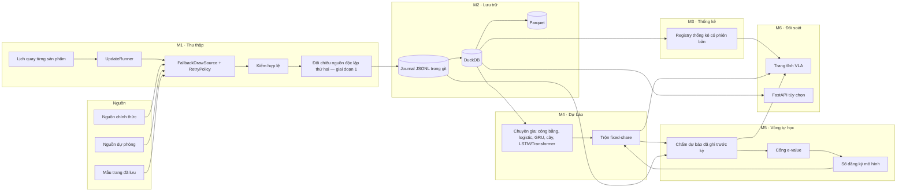

# Phân hệ Vietlott — yêu cầu kỹ thuật và kiến trúc

Ngày 08-10-2026. Tài liệu trả lời sáu nhóm yêu cầu của chủ dự án: thu thập realtime,
kho dữ liệu, thống kê, dự báo AI, vòng tự học, bảng đối soát. Nó gồm bốn phần: kiến
trúc, công nghệ, lược đồ dữ liệu, lộ trình.

Nguyên tắc viết: **mọi đề xuất neo vào mã đang có.** Engine `vietlott/` (chép từ VLM
ngày 07-10-2026) đã hiện thực phần lớn yêu cầu. Thiết kế lại từ đầu sẽ vứt đi những thứ
đã được kiểm chứng. Vì vậy mỗi yêu cầu đều được đối chiếu với module cụ thể, và chỉ phần
còn thiếu mới được đưa vào lộ trình.

## 0. Ranh giới phải nói trước

Hai yêu cầu cần được diễn đạt lại thì mới làm được một cách trung thực.

**"Nâng cao xác suất dự đoán cho các kỳ sau" (yêu cầu 5).** Nếu máy quay công bằng, xác
suất trúng của mọi bộ số bằng nhau và **không mô hình nào tăng được nó**. Mega 6/45 là
1/8 145 060, Power 6/55 là 1/28 989 675. Vòng tự học vì thế có hai việc làm được:

1. Phát hiện độ lệch THẬT nếu máy quay có, và chứng minh nó bằng kiểm định hợp lệ. Max 3D
   là ví dụ đã đo được: số 6 ở hàng đơn vị chiếm khoảng 11% thay vì 10%
   (`documentation/research/2026-10-07-max3d-hang-don-vi.md`).
2. Khi không có độ lệch, tự trả trọng số về luật công bằng. Như vậy hệ thống không bao
   giờ quảng cáo một lợi thế không tồn tại.

Thước đo của vòng tự học là **log-loss so với luật công bằng** và **e-value tích lũy**.
"Số trùng nhiều hơn kỳ trước" không phải thước đo, vì nó dao động ngẫu nhiên.

**"Confidence score" (yêu cầu 4).** Một con số kiểu "tin cậy 87%" đặt cạnh một bộ số sẽ bị
đọc thành "87% sẽ trúng", và điều đó sai. Kho này từng mắc đúng lỗi ấy với hậu nghiệm
thô (CLAUDE.md, phần Độ tin cậy dự báo). Đầu ra của engine vì thế gồm hai phần tách bạch:

- **Phân phối xác suất** đầy đủ, kèm hệ số lệch so với ngẫu nhiên (`lift`, ví dụ ×1,07).
- **Trạng thái kiểm định:** e-value, số kỳ đã chấm, p-value hợp lệ ở mọi thời điểm, đạt
  hay chưa đạt cổng.

Hai phần này không được gộp thành một phần trăm.

## 1. Đối chiếu yêu cầu với mã hiện có

| # | Yêu cầu | Đã có (module) | Còn thiếu |
|---|---|---|---|
| 1 | Crawler realtime, retry, xử lý đổi cấu trúc, polling theo lịch, dữ liệu đúng | `vlm.updates.schedule` (cửa sổ từng sản phẩm, 2 phút trong giờ quay), `vlm.updates.runner`, `crawler.http.RetryPolicy` (backoff mũ + jitter, `Retry-After`, nhận diện Cloudflare), `crawler.sources.fallback` (chuỗi nguồn dự phòng, ghi từng lần thử), `crawler.schemas` + `saved_pages` (mẫu trang đã lưu) | Chưa đối chiếu nguồn thứ hai khi nguồn đầu đã trả (nguồn đầu sai thì sai luôn); trang VLA dựng theo cron 5 lần/ngày chứ không theo sự kiện; chưa có cảnh báo "trễ quá X giờ" (hiện lượt nào thiếu một sản phẩm là đỏ); chưa có canary đổi cấu trúc chạy định kỳ |
| 2 | Kho lịch sử tối ưu chuỗi thời gian, metadata đủ | Journal `data/results/results.jsonl` (append-only, commit vào git), DuckDB `draws`/`prizes`/`sync_log`, Parquet, seed 8 sản phẩm, `vlm.database.schema` (Pydantic + SQLAlchemy, không ghi đè kết quả mâu thuẫn) | Chưa có lược đồ chuẩn hóa cho dự báo, phiên bản mô hình, backtest; bảng giải lưu dạng chuỗi JSON (`tier_winners VARCHAR`) |
| 3 | Thống kê: tần suất, co-occurrence, nóng/lạnh, gap; tinh chỉnh được | `analytics.stats` (GOF, BH-FDR, Wilson), `analytics.cooccurrence` (null Monte Carlo + FDR), `analytics.gaps` (hazard), `analytics.randomness` (χ², entropy, runs, Ljung-Box), `inference.*` (tuần tự, changepoint, đa kiểm, công suất) | Chưa có registry cho thuật toán tự viết, chưa đánh phiên bản thống kê, chưa có quy trình đăng ký giả thuyết tiến cứu cho Vietlott |
| 4 | AI dự báo, phân phối xác suất | `vietlott_engine.forecast` (hỗn hợp chuyên gia, e-process theo sản phẩm), `vlm.forecast` (logistic AdaGrad, GRU NumPy BPTT, RF/XGB/LGB, trộn fixed-share), liệt kê top-N chính xác, RTP từng cửa | Chưa có LSTM/Transformer; chưa có hợp đồng đầu ra chung cho mọi mô hình |
| 5 | Tự học sau mỗi kỳ, tự chỉnh trọng số | Học online sau mỗi kỳ, trọng số fixed-share theo log-likelihood, checkpoint JSON gzip có hash lịch sử, cổng live (e-value ≥ 140, ≥ 100 kỳ live, log-score gần đây dương) | Chưa có sổ đăng ký mô hình (shadow → challenger → production), chưa tự rollback khi kỹ năng rơi, chưa theo dõi trôi dạng `skill_monitor` |
| 6 | Bảng đối soát, Hit Rate/Precision/Recall, backtest | Sổ dự báo ghi TRƯỚC kỳ (`ledger.jsonl`, `ml-ledger.jsonl`), trang đối chiếu trên site, `backtest.engine.WalkForwardBacktester` (SPA Hansen, White Reality Check, Holm, TOST), job Docker `backtest` | Trang chưa in số trùng so với kỳ vọng ngẫu nhiên kèm khoảng tin cậy, chưa tách theo phiên bản mô hình, chưa có trang backtest |

## 2. Kiến trúc tổng thể

### 2.1 Các tầng



### 2.2 Luồng một kỳ quay (đường găng)

1. **Lên lịch.** `vlm.updates.schedule` biết cửa sổ quay của từng sản phẩm (Mega 18:00 thứ
   4, 6, CN; Lotto 13:00 và 21:00; Keno 06:00–22:15 …), theo giờ Việt Nam và không
   phụ thuộc múi giờ máy. Trong cửa sổ thì thử mỗi 2 phút, ngoài cửa sổ thì mỗi giờ.
2. **Lấy kết quả.** `FallbackDrawSource` thử lần lượt từng nguồn; mỗi nguồn đi qua
   `RetryPolicy` (backoff mũ có jitter, tôn trọng `Retry-After`). Lần thử nào cũng được
   ghi (nguồn, lỗi, số dòng), nên biết được dữ liệu đến từ đâu.
3. **Kiểm hợp lệ.**
   - Lược đồ Pydantic chặn kết quả sai luật: số ngoài miền, trùng số, sai số lượng.
   - Kết quả mâu thuẫn với bản đã lưu KHÔNG được ghi đè, mà bị đánh dấu xung đột.
   - Bản ghi chỉ có ngày thì mang `time_precision=day`, không giả giờ quay.
   - **Đối chiếu nguồn thứ hai: CHƯA CÓ.** `FallbackDrawSource.fetch` trả ngay kết quả của
     nguồn đầu tiên lấy được, và `SyncPipeline.run` upsert luôn. Một kết quả sai nhưng
     hợp lệ về hình thức từ nguồn đầu (ví dụ trang lỗi hiển thị kỳ cũ với mã kỳ mới) đi
     thẳng vào kho. Giai đoạn 1 thêm bước này: sau khi nguồn đầu trả, lấy kỳ ấy từ một
     nguồn thuộc NHÓM ĐỘC LẬP khác (như `SOURCE_INDEPENDENCE_GROUP` của XSMB) và ghi cả hai
     vào `draw_observation`. Trùng thì `validated`; lệch thì `conflict` và không công bố;
     nguồn thứ hai chưa trả được thì `single_source`, công bố kèm nhãn và thử lại.
4. **Lưu.** Ghi journal trước (nguồn sự thật, ai cũng kiểm toán được qua git), rồi
   upsert DuckDB, rồi xuất Parquet.
5. **Chấm.** Mọi dự báo cho kỳ này được chấm: log-loss, log-loss của luật công bằng, số
   trùng. Chỉ dự báo có BIÊN NHẬN bên ngoài đã kiểm (attestation Sigstore của lượt Actions,
   hoặc tem RFC 3161; cả hai ràng buộc dấu băm nội dung với thời điểm; mục 4.5) sớm hơn giờ quay có thẩm quyền (`draw_cutoff_effective`: suy từ ngày quay đã đối chiếu và lịch quay có biên nhận, mục 4.5), cho một kỳ
   được hai nhóm nguồn độc lập xác nhận, mới được cập nhật e-value. Giờ phát và giờ đích do
   chính dự báo khai không được dùng để xét.
6. **Học — chỉ từ kỳ `validated`.** Các chuyên gia cập nhật online; trọng số trộn cập nhật
   theo log-likelihood thật; cây quyết định được fit lại định kỳ trên một vùng đệm giới
   hạn. Kỳ `single_source` hay `conflict` KHÔNG được đưa vào học. Một kết quả sai của nguồn
   đầu sẽ làm hỏng checkpoint và mọi dự báo phát trước khi đối chiếu xong, kể cả của mô
   hình production.
   - Việc học đi đúng thứ tự mã kỳ, nên một kỳ chưa `validated` chặn việc học các kỳ sau
     nó.
   - Dự báo kỳ tới vẫn được phát, từ trạng thái đã học tới kỳ `validated` cuối cùng.
     `history_sha256` ghi đúng lịch sử ấy, nên dự báo vẫn hợp lệ, chỉ cũ hơn một kỳ.
   - Khi đối chiếu xong, nếu kỳ thành `validated` thì học tiếp theo thứ tự. Nếu kỳ được
     đính chính thì phát lại tất định từ kỳ ấy, như khi sửa dữ liệu quá khứ.
7. **Dự báo kỳ tới.** Engine phát luật xác suất cho kỳ tới và ghi sổ kèm `history_sha256`
   cùng thời điểm phát. Nếu chưa qua cổng, luật công bố là luật công bằng; luật của mô
   hình được ghi rõ là thử nghiệm.
8. **Xuất bản.** Dựng 8 trang Vietlott qua `page_output.write_page` rồi triển khai Pages.

### 2.3 Vì sao "webhook" là polling

Theo những gì đã biết, nguồn kết quả không có webhook công khai, nên chiều vào chỉ có
thể là polling theo lịch. Webhook hợp lý ở **chiều ra**: khi M1 lưu được kết quả mới, nó
phát sự kiện `draw.ingested` để các bước sau chạy ngay thay vì chờ cron.

- **Trên GitHub Actions:** dùng `workflow_run` hoặc `repository_dispatch`. Sự kiện đẩy code
  bằng `GITHUB_TOKEN` không kích hoạt workflow khác, nhưng hai trigger này thì có.
- **Ở chế độ máy chủ thường trực:** FastAPI gọi trực tiếp hàm học và dựng trang.

### 2.4 Hai chế độ vận hành

| | Chế độ A — tĩnh (đang chạy) | Chế độ B — máy chủ thường trực (tùy chọn) |
|---|---|---|
| Thu thập | `vlm-results.yml` mỗi 10 phút ban ngày, mỗi giờ ban đêm | API Docker, kiểm tra mỗi 2 phút trong cửa sổ quay |
| Độ trễ thực tế | 10–40 phút (cron GitHub có thể bị hoãn) | khoảng 2–5 phút sau khi nguồn công bố |
| Lưu trữ | Journal trong git + cache DuckDB | Volume Docker `vqe-data` |
| Hiển thị | Trang tĩnh trên GitHub Pages | Trang tĩnh, cộng API `/forecast`, `/updates/status` |
| Chi phí | 0 | Một VPS nhỏ (1 vCPU, 1–2 GB RAM) |

"Realtime" theo nghĩa vài phút chỉ đạt được ở chế độ B. Việc có thuê máy chủ hay không là
quyết định của chủ dự án. Chế độ A vẫn đúng dữ liệu, chỉ chậm hơn. Bước 1 của lộ trình rút
độ trễ ở chế độ A bằng cách dựng trang theo sự kiện.

## 3. Đề xuất công nghệ

**Xung đột cần chủ dự án quyết.** `.github/workflows/vlm-results.yml` và
`vietlott/docker-compose.yml` hiện đặt `VQE_HTTP_BACKEND: curl_cffi`. Cấu hình này chép
nguyên từ VLM, và trái `SECURITY.md` của VLA. Mặc định của engine là `httpx`. Đưa về
`httpx` là đúng chính sách nhưng có thể làm một số nguồn trả "không khả dụng" thường hơn.
Thiết kế dưới đây theo đúng chính sách.

Ràng buộc của kho quyết định một nửa lựa chọn (CLAUDE.md):
- trang tĩnh trên GitHub Pages;
- CSS viết tay, không framework JS;
- dựng DOM bằng `createElement`, không gán chuỗi HTML;
- không in tên nguồn dữ liệu ra trang.

| Tầng | Chọn | Lý do | Không chọn, và vì sao |
|---|---|---|---|
| Crawler | Python 3.11+, `httpx` bất đồng bộ (HTTP thông thường), BeautifulSoup/lxml | Đang chạy và có kiểm thử; `RetryPolicy` và chuỗi dự phòng đã viết | `curl_cffi` và mọi thư viện giả vân tay trình duyệt: trái `SECURITY.md` (Thu thập dữ liệu công khai). Nguồn chặn truy cập thì ghi là không khả dụng và dùng nguồn dự phòng, không tìm cách vượt. Scrapy (nặng cho vài trang/kỳ). Playwright (cũng là giả lập trình duyệt, cùng lý do) |
| Lịch | `vlm.updates` (chế độ B), cron GitHub Actions (chế độ A) | Lịch theo từng sản phẩm, chạy lại an toàn | Celery/Airflow: quá tải cho 8 sản phẩm |
| Lưu trữ | Journal JSONL trong git + DuckDB + Parquet | Dữ liệu nhỏ: Keno 297 398 kỳ × 20 số khoảng 6 triệu giá trị, nằm gọn trong RAM. DuckDB cột hóa, truy vấn cửa sổ thời gian nhanh, nhúng được, không cần dịch vụ riêng. Journal trong git cho phép kiểm toán và khôi phục khi mất cache | TimescaleDB/PostgreSQL: chỉ cần khi có nhiều tiến trình cùng ghi ở chế độ B. Engine đã có extra `postgres` để chuyển khi cần |
| Thống kê | NumPy, SciPy, `vietlott_engine.analytics` / `inference` | Đã có null Monte Carlo, FDR, kiểm định tuần tự | — |
| ML | NumPy (GRU, logistic online), scikit-learn, XGBoost, LightGBM (extra `ml`) | Đang chạy, checkpoint JSON (không dùng pickle) | — |
| Deep learning | PyTorch CPU, extra `[deep]` tùy chọn | LSTM/Transformer làm **chuyên gia thách đấu** trong hỗn hợp fixed-share; không cần GPU vì mô hình nhỏ | TensorFlow (nặng, không thêm gì); GPU (không đáng với lượng dữ liệu này) |
| Sổ mô hình | Checkpoint JSON + bảng `model_version` + sổ dự báo append-only | Đủ để truy vết: mã, cấu hình, hash lịch sử | MLflow: thêm một dịch vụ mà không thêm bằng chứng |
| Backend | FastAPI + Uvicorn **1 worker** (chế độ B) | Đã có router; DuckDB chỉ cho một tiến trình ghi | Nhiều worker (đã chặn trong CLI) |
| Frontend | HTML tĩnh qua `page_output.write_page`, CSS tay, JS thuần, biểu đồ SVG dựng sẵn bằng Python, dữ liệu JSON tại `docs/data/vietlott/` | Đúng luật của kho; nhanh; không cần build | React/Tailwind/Chart.js: trái CLAUDE.md |
| Kiểm thử | pytest (369 phép của engine + bộ VLA), kiểm thử đột biến, mẫu trang đã lưu | Kỷ luật kiểm thử của kho | — |

## 4. Lược đồ dữ liệu

Lược đồ dưới đây dùng kiểu của DuckDB và chạy được trên PostgreSQL với thay đổi nhỏ. Nó
**không thay thế ngay** các bảng `draws`/`prizes`/`sync_log` đang chạy. Bước 2 của lộ
trình dựng nó thành bảng mới cùng view tương thích, rồi chuyển dần từng nơi đọc.

**Gốc tin cậy.** Cổng đề bạt và rollback chỉ đọc ba loại giá trị:

1. **Sự kiện do bên ngoài chứng nhận:** biên nhận (attestation Sigstore, tem RFC 3161) phủ
   dấu băm nội dung, do bộ kiểm xác minh chữ ký, dấu băm và mốc giờ.
2. **Giá trị SQL suy ra được:** nhóm nguồn, xác nhận kỳ, mốc xét quyền, wealth, các lần so,
   số kỳ và trung bình của phép so. Chúng là view, không lưu.
3. **Giá trị chỉ mã mới tính được:** log-loss của một luật hỗn hợp, cận dưới chuỗi tin cậy
   Choe–Ramdas. Chúng do workflow chấm điểm công khai sinh ra, chạy trên `main` ở đúng
   `code_sha`. Workflow ký attestation phủ bản kê các dòng nó ghi, và bản kê được tính lại
   từ dòng thật (`scoring_run`, mục 4.5). Ai cũng chạy lại được trên cùng đầu vào. Dòng sửa
   tay, dòng do bộ nạp khác ghi, hay dòng sửa sau khi ký đều không vào cổng. Có nhiều lượt
   hợp lệ thì lấy giá trị KÉM thuận lợi nhất cho mô hình, nên chạy lại không giúp được gì.

Gốc tin cậy cuối cùng là mã chấm điểm đã qua review trên `main`; lược đồ không thay được
review ấy.

### 4.1 Danh mục và kết quả

```sql
-- Luật của từng sản phẩm: một chỗ khai báo, mọi module đọc từ đây.
CREATE TABLE game (
    code            VARCHAR PRIMARY KEY,          -- mega645, power655, lotto535, max3d, max3dpro, keno, bingo18, max4d
    kind            VARCHAR NOT NULL CHECK (kind IN ('set', 'digit', 'dice')),
    pool_n          SMALLINT,                     -- 45, 55, 35, 80; NULL cho loại chữ số
    pick_k          SMALLINT NOT NULL,            -- 6, 6, 5, 20, 3, ...
    digit_width     SMALLINT,                     -- 3 cho Max 3D, 4 cho Max 4D
    bonus_rule      VARCHAR,                      -- 'same_drum' (Power), 'separate_1_12' (Lotto), NULL
    -- Lịch quay KHÔNG nằm ở đây: nó quyết định mốc xét quyền, nên có phiên bản và biên nhận
    -- (game_schedule ngay dưới).
    active          BOOLEAN NOT NULL DEFAULT TRUE
);

-- Lịch quay theo giờ VN, CÓ PHIÊN BẢN và chỉ chèn. Mỗi phiên bản có biên nhận bên ngoài
-- (receipt, subject_kind = 'game_schedule', subject_id = game@valid_from) và chỉ có hiệu lực
-- từ max(valid_from, receipt_at), như sổ nguồn. Một kỳ chỉ dùng phiên bản đã có hiệu lực
-- TRƯỚC đầu ngày quay của nó: sửa lịch sau khi quay không áp ngược được.
CREATE TABLE game_schedule (
    game            VARCHAR NOT NULL REFERENCES game(code),
    valid_from      TIMESTAMPTZ NOT NULL,
    slots_by_isodow TIME[][] NOT NULL,            -- 7 danh sách giờ quay tăng dần; phần tử 1 = thứ Hai
                                                  -- (Mega: [[], [], [18:00], [], [18:00], [], [18:00]])
    -- hash KHÔNG lưu: view row_digest tính lại từ chính các cột (mục 4.5)
    PRIMARY KEY (game, valid_from),
    CHECK (len(slots_by_isodow) = 7)
);

-- Một dòng cho mỗi kỳ ĐÃ XÁC THỰC. Khóa tự nhiên (game, draw_id).
CREATE TABLE draw (
    game            VARCHAR  NOT NULL REFERENCES game(code),
    draw_id         INTEGER  NOT NULL,
    draw_ts         TIMESTAMPTZ NOT NULL,         -- giờ quay; 00:00 nếu chỉ biết ngày
    time_precision  VARCHAR  NOT NULL CHECK (time_precision IN ('minute', 'day')),
    -- Hai mốc thời gian, hai mục đích, KHÔNG dùng lẫn:
    -- (mốc xét dự báo ghi trước kỳ là view draw_cutoff_effective ở mục 4.5, SUY RA, không lưu)
    scheduled_slot_ts TIMESTAMPTZ,                -- CHỈ để đo độ trễ: giờ quay theo lịch của ĐÚNG
                                                  -- kỳ này. draw_ts nếu biết đến phút; nếu chỉ biết
                                                  -- ngày thì suy từ thứ tự mã kỳ trong ngày khi lịch
                                                  -- có số kỳ cố định (Lotto: kỳ nhỏ 13:00, kỳ lớn
                                                  -- 21:00); NULL khi không suy được (Keno, Bingo18
                                                  -- chỉ có ngày) và kỳ ấy không vào phép đo độ trễ.
    numbers         SMALLINT[] NOT NULL,          -- theo thứ tự quay nếu biết, nếu không thì đã sắp
    numbers_ordered BOOLEAN  NOT NULL,            -- TRUE khi giữ được thứ tự quay
    bonus           SMALLINT,
    status          VARCHAR  NOT NULL CHECK (status IN ('validated', 'single_source', 'conflict')),
    -- Nguồn gốc của bản ghi. Journal chỉ có các kỳ gần đây (1 986 dòng ngày 08-10-2026);
    -- phần lớn lịch sử đến từ tệp seed đã commit (Keno 297 398 dòng, Bingo18 105 593 dòng…).
    -- Mọi tệp ấy đều nằm trong git, nên hash của đúng dòng sinh ra bản ghi luôn tính lại được.
    provenance_kind VARCHAR  NOT NULL CHECK (provenance_kind IN ('journal', 'seed', 'product_store')),
    provenance_ref  VARCHAR  NOT NULL,            -- đường dẫn tệp trong kho, ví dụ data/seed/keno.jsonl.gz
    provenance_sha256 VARCHAR NOT NULL,           -- sha256 của đúng dòng sinh ra bản ghi
    first_seen_at   TIMESTAMPTZ NOT NULL,         -- lúc crawler thấy kỳ này lần đầu
    PRIMARY KEY (game, draw_id)
);
CREATE INDEX draw_by_time ON draw (game, draw_ts);

-- Nhóm độc lập của từng nguồn, CÓ HIỆU LỰC THEO THỜI GIAN và chỉ chèn: hai nguồn khác tên
-- nhưng chép cùng một nơi phải chung một nhóm. Đổi nhóm của một nguồn là một dòng mới, không
-- sửa dòng cũ. valid_from do bên ghi tự khai, nên mỗi dòng có BIÊN NHẬN bên ngoài (bảng
-- receipt, subject_kind = 'source_registry'). Một phiên bản chỉ có hiệu lực từ
-- max(valid_from, receipt_at): ghi lùi valid_from KHÔNG áp ngược được lên quan sát đã có.
CREATE TABLE source_registry (
    source_code     VARCHAR NOT NULL,
    independence_group VARCHAR NOT NULL,          -- mã ẩn danh của nhà cung cấp gốc
    valid_from      TIMESTAMPTZ NOT NULL,
    note            VARCHAR NOT NULL,             -- vì sao xếp vào nhóm này (đã kiểm thế nào)
    -- hash KHÔNG lưu: view row_digest tính lại từ chính các cột (mục 4.5)
    PRIMARY KEY (source_code, valid_from)
);


-- (draw_observation nằm ở mục 4.3, sau ingestion_run mà nó tham chiếu; view
-- draw_corroboration ở mục 4.5, sau observation_group)
```

### 4.2 Giải thưởng và jackpot

```sql
-- Bảng giải theo ĐÚNG mã kỳ; khuyết thì không có dòng (trang in "—"), không mượn kỳ trước.
CREATE TABLE prize_tier (
    game            VARCHAR NOT NULL,
    draw_id         INTEGER NOT NULL,
    tier_code       VARCHAR NOT NULL,             -- jackpot1, jackpot2, first, second, ...
    condition       VARCHAR NOT NULL,             -- "6 số chính", "5 số + số đặc biệt"
    value_vnd       BIGINT,                       -- NULL = chưa công bố
    winners         INTEGER,                      -- NULL = chưa công bố
    is_pool         BOOLEAN NOT NULL,             -- giải chia theo quỹ (jackpot)
    PRIMARY KEY (game, draw_id, tier_code),
    FOREIGN KEY (game, draw_id) REFERENCES draw(game, draw_id)
);

-- Giá trị jackpot TRƯỚC kỳ quay: cần để tính RTP và kỳ vọng thật của vé.
CREATE TABLE jackpot_snapshot (
    game            VARCHAR NOT NULL,
    draw_id         INTEGER NOT NULL,
    pot_code        VARCHAR NOT NULL,             -- jackpot1, jackpot2
    value_vnd       BIGINT  NOT NULL,
    rolled_over     BOOLEAN,                      -- kỳ trước không ai trúng
    PRIMARY KEY (game, draw_id, pot_code)
);
```

### 4.3 Vận hành thu thập

```sql
-- Mỗi lượt thu thập có biên nhận bên ngoài (receipt, subject_kind = 'ingestion_run'), xin
-- SAU khi lượt ghi xong, phủ bản kê quan sát của lượt (view run_manifest bên dưới). Giờ biên
-- nhận là mốc DUY NHẤT dùng để chọn phiên bản sổ nguồn cho các quan sát ấy. observed_at tự
-- khai chỉ để hiển thị. Một lượt phát lại chèn sau, kể cả ghi lùi observed_at, nhận biên
-- nhận MỚI, nên dùng phiên bản sổ hiện hành chứ không chọn được nhóm cũ.
CREATE TABLE ingestion_run (
    run_id          VARCHAR PRIMARY KEY,
    trigger         VARCHAR NOT NULL CHECK (trigger IN ('schedule', 'api', 'manual', 'replay')),
    started_at      TIMESTAMPTZ NOT NULL,
    finished_at     TIMESTAMPTZ,
    status          VARCHAR NOT NULL CHECK (status IN ('ok', 'partial', 'failed'))
    -- Không lưu hash bản kê: hash lưu sẵn không chứng minh được dòng nào nằm trong nó. Bản kê
    -- được TÍNH LẠI từ chính các dòng quan sát (run_manifest).
);

CREATE TABLE source_attempt (
    run_id          VARCHAR NOT NULL REFERENCES ingestion_run(run_id),
    game            VARCHAR NOT NULL,
    source_code     VARCHAR NOT NULL,
    attempt_no      SMALLINT NOT NULL,            -- 1, 2, 3 ... mỗi lần RetryPolicy thử lại là một dòng
    attempted_at    TIMESTAMPTZ NOT NULL,
    ok              BOOLEAN NOT NULL,
    rows_fetched    INTEGER,
    rows_inserted   INTEGER,
    rows_rejected   INTEGER,
    error_class     VARCHAR,                      -- timeout, http_5xx, cloudflare, parse_schema, no_newer
    http_status     SMALLINT,
    latency_ms      INTEGER,
    PRIMARY KEY (run_id, game, source_code, attempt_no)
);

-- Mỗi nguồn nhìn thấy gì: phát hiện mâu thuẫn mà không ghi đè.
CREATE TABLE draw_observation (
    game            VARCHAR NOT NULL,
    draw_id         INTEGER NOT NULL,
    source_code     VARCHAR NOT NULL,             -- mã ẩn danh, KHÔNG phải tên miền
    run_id          VARCHAR NOT NULL REFERENCES ingestion_run(run_id),   -- lượt đã ghi quan sát này
    -- KHÔNG lưu nhóm độc lập ở đây: một giá trị do bên ghi tự điền có thể gõ sai hay khác
    -- nhau giữa hai lần ghi cùng một nguồn. Nhóm được SUY RA ở view observation_group từ
    -- source_registry, đúng phiên bản có hiệu lực lúc lượt thu thập nhận biên nhận.
    observed_at     TIMESTAMPTZ NOT NULL,         -- tự khai, chỉ để hiển thị; không dùng để xét
    draw_date       DATE NOT NULL,                -- ngày quay (giờ VN) theo nguồn: được đối chiếu như
                                                  -- số liệu, vì mốc xét quyền suy từ ngày này
    -- Không lưu con trỏ tới phiên bản sổ: con trỏ lưu sẵn có thể trỏ vào một bản đã cũ. Phiên
    -- bản áp dụng được SUY RA ở view observation_group từ thời điểm hiệu lực có biên nhận.
    numbers         SMALLINT[] NOT NULL,
    bonus           SMALLINT,
    raw_sha256      VARCHAR NOT NULL,             -- hash nội dung trang/JSON gốc
    -- Không lưu cờ "trùng/không trùng": việc trùng được TÍNH LẠI từ số liệu ở view dưới đây,
    -- nên đính chính một kỳ hay một lỗi ghi cờ không làm lệch kết quả xác nhận.
    PRIMARY KEY (game, draw_id, source_code, run_id)
);

-- Bản kê của mỗi lượt, TÍNH LẠI từ đúng các dòng đang có: hash của từng dòng ở dạng JSON
-- chuẩn (to_json theo thứ tự cột cố định; giờ là epoch micro giây, không phụ thuộc múi giờ
-- phiên), sắp xếp rồi nối và băm. Bộ ghi tính bản kê bằng CHÍNH view này trên bản nháp
-- trước khi xin biên nhận. Chèn thêm, sửa hay xóa một dòng dưới một run_id đã có biên nhận
-- đều làm bản kê lệch biên nhận, và CẢ lượt ấy bị loại (observation_group ra nhóm NULL),
-- chứ không chỉ dòng chèn thêm.
CREATE VIEW run_manifest AS
SELECT run_id, count(*) AS n_observations,
       sha256(string_agg(row_sha256, chr(10) ORDER BY row_sha256)) AS observations_sha256
FROM (
    SELECT run_id,
           sha256(to_json(struct_pack(game := game, draw_id := draw_id, source_code := source_code,
                                      observed_us := epoch_us(observed_at), draw_date := draw_date,
                                      numbers := numbers,
                                      bonus := bonus, raw_sha256 := raw_sha256))::VARCHAR) AS row_sha256
    FROM draw_observation
)
GROUP BY run_id;

-- Lần triển khai trang ĐẦU TIÊN có kỳ này: mốc cuối của độ trễ đầu-cuối (mốc đầu là
-- draw.scheduled_slot_ts, KHÔNG phải draw_cutoff_effective).
CREATE TABLE publication (
    game            VARCHAR NOT NULL,
    draw_id         INTEGER NOT NULL,
    deployed_at     TIMESTAMPTZ NOT NULL,         -- lúc deploy Pages hoàn tất
    deploy_run      VARCHAR NOT NULL,             -- mã lượt workflow / bản dựng
    PRIMARY KEY (game, draw_id),
    FOREIGN KEY (game, draw_id) REFERENCES draw(game, draw_id)
);
```

`error_class = 'parse_schema'` trên một nguồn vốn ổn định là tín hiệu **nguồn đổi cấu
trúc**. Cảnh báo nên dựa vào nó và vào độ trễ (`now() − draw_ts` của kỳ đến hạn), chứ không
dựa vào việc một lượt chạy đỏ.

### 4.4 Thống kê có phiên bản

```sql
CREATE TABLE stat_definition (
    stat_code       VARCHAR NOT NULL,             -- frequency, cooccurrence, gap_hazard, ...
    version         INTEGER NOT NULL,             -- tăng khi định nghĩa đổi (như STAT_VERSION)
    params          JSON    NOT NULL,             -- cửa sổ, hệ số suy giảm, số mô phỏng null
    null_model      VARCHAR NOT NULL,             -- mô tả phép so: Monte Carlo, hypergeometric, ...
    PRIMARY KEY (stat_code, version)
);

CREATE TABLE stat_snapshot (
    game            VARCHAR NOT NULL,
    stat_code       VARCHAR NOT NULL,
    version         INTEGER NOT NULL,
    as_of_draw_id   INTEGER NOT NULL,             -- chỉ dùng dữ liệu tới kỳ này
    payload         JSON    NOT NULL,             -- giá trị + p/q-value so với null
    computed_at     TIMESTAMPTZ NOT NULL,
    PRIMARY KEY (game, stat_code, version, as_of_draw_id)
);

-- Giả thuyết TIẾN CỨU: tham số chốt trước khi có dữ liệu kiểm, như data/hypotheses/*.csv của XSMB.
CREATE TABLE hypothesis (
    hypothesis_id   VARCHAR PRIMARY KEY,          -- ví dụ max3d_units_6_2026_10
    game            VARCHAR NOT NULL,
    statement       VARCHAR NOT NULL,
    registered_at   TIMESTAMPTZ NOT NULL,
    first_draw_id   INTEGER NOT NULL,             -- kỳ đầu tiên được tính
    n_draws         INTEGER NOT NULL,
    alpha           DOUBLE  NOT NULL,
    test            VARCHAR NOT NULL,
    params          JSON    NOT NULL              -- tham số đầy đủ: đủ để chạy lại đúng phép kiểm
    -- hash KHÔNG lưu: view row_digest tính lại từ chính các cột (mục 4.5)
);
-- Đăng ký xong thì bảng chỉ được chèn, không được sửa: quyền UPDATE/DELETE bị thu hồi, và
-- bản đăng ký được commit vào git như sổ data/hypotheses/*.csv của XSMB (lần ghi đầu giữ nguyên).
-- Giả thuyết chỉ là TIẾN CỨU khi được đăng ký TRƯỚC giờ quay của kỳ đầu tiên nó tính. Lúc
-- đăng ký, kỳ ấy thường chưa có trong draw, nên không thể là khóa ngoại hay CHECK; view
-- hypothesis_eligibility (mục 4.5, sau bảng receipt) xét lại khi kỳ đã có. Kết quả của giả thuyết nào không 'prospective' thì không được
-- tính và không được in như phép kiểm tiến cứu. Mốc dùng để xét là BIÊN NHẬN bên ngoài
-- (bảng receipt, mục 4.5), không phải registered_at tự khai, cũng không phải ngày commit
-- của git, vốn cũng tự khai được.
```

### 4.5 Mô hình, dự báo, chấm điểm

```sql
-- Nội dung một phiên bản (họ, mã nguồn, cấu hình, giờ tạo) nằm trong hash của MỌI lần phát dùng
-- nó (view row_digest). Sửa dòng này sau khi đã phát thì biên nhận của các lần phát ấy không còn
-- phủ hash tính lại, nên chúng rơi khỏi bằng chứng thay vì được gán cho mã khác. Phiên bản mới
-- là model_id mới.
CREATE TABLE model_version (
    model_id        VARCHAR PRIMARY KEY,          -- ví dụ vlm-ml/gru@3, deep/lstm@1
    family          VARCHAR NOT NULL,             -- fair, logistic, gru, tree, lstm, transformer, mixture
    code_sha        VARCHAR NOT NULL,             -- commit của mã
    config          JSON    NOT NULL,
    created_at      TIMESTAMPTZ NOT NULL
);

-- Giai đoạn của một mô hình là THEO SẢN PHẨM và THEO THỜI GIAN, không phải một thuộc tính
-- của model_id. Cùng một LSTM có thể là production cho Max 3D mà vẫn là shadow cho Mega.
-- Mỗi lần đổi giai đoạn là một dòng mới (append-only), không ghi đè, nên luôn trả lời
-- được: "kỳ t của sản phẩm p, mô hình nào đang chạy?". Đề bạt, rollback và mô hình
-- "đang chạy" để so trong cổng đều đọc từ đây, qua view deployment_effective (mục 4.5): mỗi
-- dòng phải có biên nhận (subject_kind = 'model_deployment', subject_id =
-- game/model_id@effective_from_draw_id) SỚM HƠN mốc xét quyền của kỳ hiệu lực. Không ghi lùi
-- được một lần đổi production để cắt đúng chỗ có lợi cho một thách đấu. Ngoại lệ duy nhất là
-- dòng khởi tạo ('fair', production, lý do 'initial', kỳ hiệu lực nhỏ nhất của sản phẩm).
-- Khi một mô hình được đề bạt, production cũ nhận dòng 'shadow' cùng kỳ hiệu lực và VẪN phát
-- dự báo ghi trước kỳ: detector so với mô hình tiền nhiệm cần điểm của nó.
CREATE TABLE model_deployment (
    game            VARCHAR NOT NULL REFERENCES game(code),
    model_id        VARCHAR NOT NULL REFERENCES model_version(model_id),
    stage           VARCHAR NOT NULL CHECK (stage IN ('shadow', 'challenger', 'production', 'retired')),
    effective_from_draw_id INTEGER NOT NULL,      -- có hiệu lực từ kỳ này (kỳ đầu tiên dự báo theo stage mới)
    decided_at      TIMESTAMPTZ NOT NULL,
    reason          VARCHAR NOT NULL,             -- gate_passed, e_detector_alarm, manual, superseded, initial, ...
    -- hash KHÔNG lưu: view row_digest tính lại từ chính các cột (mục 4.5)
    PRIMARY KEY (game, model_id, effective_from_draw_id)
);
-- Bất biến (kiểm bằng phép kiểm, vì DuckDB không có chỉ mục duy nhất có điều kiện):
-- ở mỗi kỳ của mỗi sản phẩm có ĐÚNG MỘT mô hình production; nếu chưa có gì qua cổng
-- thì đó là mô hình luật công bằng ('fair').

-- Phân bổ alpha cho MỌI mô hình từng được thử trên một sản phẩm. Bảo đảm "tổng alpha ≤ 0,05"
-- chỉ đúng khi seq_no được chốt VĨNH VIỄN trước dự báo live đầu tiên và alpha đúng bằng công
-- thức. Vì vậy:
--   * alpha là cột SINH từ seq_no, không lưu được một giá trị khác;
--   * bảng chỉ được chèn: quyền UPDATE/DELETE bị thu hồi, và sổ gate_allocation được commit
--     vào git như data/hypotheses/*.csv (lần ghi đầu giữ nguyên, phép kiểm so kho với sổ);
--   * bất biến kiểm bằng phép kiểm: seq_no của mỗi sản phẩm liên tục 1..n (xoá một dòng để
--     dùng lại số nhỏ sẽ làm hở dãy), và BIÊN NHẬN của dòng phân bổ (bảng receipt,
--     subject_kind = 'gate_allocation') sớm hơn biên nhận của mọi dự báo của (game, model_id) ấy.
CREATE TABLE gate_allocation (
    game            VARCHAR NOT NULL REFERENCES game(code)
                    -- ĐÚNG 7 sản phẩm được cấp alpha, khớp mẫu số 7 của công thức. Max 4D đã
                    -- ngừng phát hành, không có kỳ tới nên không có dự báo live, và bị loại
                    -- bằng ràng buộc chứ không chỉ bằng lời. Thêm một sản phẩm mới thì phải mở
                    -- ngân sách alpha mới cho cả họ, không được nới danh sách này.
                    CHECK (game IN ('mega645', 'power655', 'lotto535', 'max3d', 'max3dpro', 'keno', 'bingo18')),
    model_id        VARCHAR NOT NULL REFERENCES model_version(model_id),
    seq_no          INTEGER NOT NULL CHECK (seq_no >= 1),
    alpha           DOUBLE  GENERATED ALWAYS AS ((0.05 / 7) * 6 / (pi() ^ 2 * seq_no * seq_no)) VIRTUAL,
    registered_at   TIMESTAMPTZ NOT NULL,
    -- hash KHÔNG lưu: view row_digest tính lại từ chính các cột (mục 4.5)
    PRIMARY KEY (game, model_id),
    UNIQUE (game, seq_no)
);

-- Ghi TRƯỚC giờ quay; append-only. Một mô hình CÓ THỂ phát nhiều lần cho cùng một kỳ: sổ
-- hiện có 10 cặp (sản phẩm, kỳ) như vậy, ví dụ Mega kỳ 1571 có 4 lần phát với digest khác
-- nhau. Mọi lần phát đều được giữ để không mất dấu vết kiểm toán. Nhưng chấm mọi lần sẽ
-- dùng một kết quả nhiều lần và thổi phồng bằng chứng, nên chỉ lần phát ĐẦU TIÊN của mỗi
-- (game, model_id, target_draw_id) được vào e-value (view evidence_issue). Đây cũng là
-- luật "lần ghi đầu giữ nguyên" của các sổ trong kho, và luật chọn được chốt trước kỳ quay.
CREATE TABLE forecast_issue (
    forecast_id     VARCHAR PRIMARY KEY,          -- mã của lần phát
    -- hash KHÔNG lưu: view row_digest tính lại từ chính các cột (mục 4.5)
    legacy          BOOLEAN NOT NULL DEFAULT FALSE,   -- dòng nạp từ sổ cũ không đủ trường (xem 4.6)
    game            VARCHAR NOT NULL,
    model_id        VARCHAR NOT NULL REFERENCES model_version(model_id),
    target_draw_id  INTEGER NOT NULL,
    target_draw_ts  TIMESTAMPTZ NOT NULL,         -- giờ đích DỰ BÁO tự khai: chỉ để hiển thị,
                                                  -- KHÔNG dùng để xét quyền vào bằng chứng
    based_on_draw_id INTEGER NOT NULL,
    history_sha256  VARCHAR,                      -- lịch sử dùng để dự báo; NULL chỉ ở dòng legacy
    issued_at       TIMESTAMPTZ NOT NULL,
    law             JSON,                         -- phân phối đầy đủ ĐÚNG như đã phát; NULL chỉ ở dòng legacy
    top_n           JSON    NOT NULL,             -- bộ số đề xuất + p_model, p_fair, lift
    UNIQUE (forecast_id, game, target_draw_id),   -- đích của khóa ngoại ghép trong forecast_score
    -- Dòng không legacy phải có đủ luật và hash lịch sử; dòng legacy không bao giờ có điểm
    -- log-loss (không có luật để chấm) và không vào bằng chứng.
    CHECK (legacy OR (law IS NOT NULL AND history_sha256 IS NOT NULL))
);

-- Mã kỳ chỉ duy nhất TRONG một sản phẩm (mọi sản phẩm bắt đầu từ kỳ 1), nên điểm luôn đi
-- kèm game. Hai khóa ngoại ghép buộc: kỳ được chấm đúng là kỳ đích của dự báo, và kỳ ấy có
-- thật trong draw của CÙNG sản phẩm. Điểm của Mega không thể gắn vào kết quả Power.
-- Một lượt của workflow chấm điểm (gốc tin cậy, loại 3). Biên nhận của lượt
-- (subject_kind = 'scoring_run') phải là attestation Sigstore của ĐÚNG workflow chấm trên
-- refs/heads/main ở commit code_sha, phủ bản kê các dòng lượt ấy ghi (view attested_run).
CREATE TABLE scoring_run (
    run_id          VARCHAR PRIMARY KEY,
    kind            VARCHAR NOT NULL CHECK (kind IN ('score', 'comparison')),
    code_sha        VARCHAR NOT NULL,             -- commit của mã chấm
    started_at      TIMESTAMPTZ NOT NULL
);

CREATE TABLE forecast_score (
    forecast_id     VARCHAR NOT NULL,
    run_id          VARCHAR NOT NULL REFERENCES scoring_run(run_id),
    game            VARCHAR NOT NULL,
    draw_id         INTEGER NOT NULL,
    forecast_sha256 VARCHAR NOT NULL,             -- hash chuẩn (row_digest) của lần phát đã chấm
    outcome_sha256  VARCHAR NOT NULL,             -- hash kết quả kỳ đã dùng (cùng biểu thức như live_score)
    log_loss        DOUBLE  NOT NULL,             -- −log p_model(kết quả thật)
    log_loss_fair   DOUBLE  NOT NULL,             -- −log p_công_bằng(kết quả thật)
    brier           DOUBLE,
    scored_at       TIMESTAMPTZ NOT NULL,
    -- Một lần phát có thể được chấm lại (đính chính kỳ, sửa mã chấm): mỗi lượt một dòng.
    PRIMARY KEY (forecast_id, run_id),
    FOREIGN KEY (forecast_id, game, draw_id) REFERENCES forecast_issue(forecast_id, game, target_draw_id),
    FOREIGN KEY (game, draw_id) REFERENCES draw(game, draw_id)
);

-- Quyền vào bằng chứng TÍNH LẠI từ giờ quay có thẩm quyền của kỳ đã xác thực, không lưu
-- thành cờ. Lỗi lịch hay lỗi nạp làm target_draw_ts sai cũng không lọt được dự báo phát
-- sau khi quay vào cổng e-value. Chỉ kỳ 'validated' (hai nguồn độc lập trùng nhau) được
-- tính: kỳ 'single_source' chính là trạng thái mà một kết quả sai của nguồn đầu chưa bị
-- phát hiện. Khi đối chiếu xong và kỳ chuyển sang 'validated', view tự tính dòng ấy, và
-- evidence_state (cũng là view) tự tính lại từ kỳ đó trở đi. evidence_state chỉ đọc live_eligible.
-- Điểm của TỪNG vé/ứng viên trong top_n (bộ dự báo hiện phát 5 vé mỗi kỳ). forecast_score
-- giữ điểm của cả LUẬT xác suất (log-loss); số trùng, precision, hit rate tính trên đây, qua
-- view valid_candidate_score. Dòng thuộc một lượt chấm (cùng bản kê có attestation với
-- forecast_score), mang hash của LẦN PHÁT đã chấm và hash kết quả đã dùng: sửa top_n hay phiên
-- bản mô hình sau khi chấm, hoặc đính chính kỳ, thì số trùng cũ tự rơi ra.
CREATE TABLE candidate_score (
    forecast_id     VARCHAR NOT NULL REFERENCES forecast_issue(forecast_id),  -- cả dòng legacy
    run_id          VARCHAR NOT NULL REFERENCES scoring_run(run_id),
    forecast_sha256 VARCHAR NOT NULL,             -- hash lần phát đã chấm (row_digest, cả dòng legacy)
    outcome_sha256  VARCHAR NOT NULL,             -- hash kết quả kỳ đã dùng (cùng biểu thức như valid_score)
    rank            SMALLINT NOT NULL CHECK (rank >= 1),   -- thứ hạng trong top_n lúc phát
    candidate       JSON    NOT NULL,             -- bộ số / số chữ số đúng như đã công bố
    p_model         DOUBLE,                       -- NULL ở dòng legacy (sổ cũ không lưu)
    p_fair          DOUBLE  NOT NULL,
    hits            DOUBLE  NOT NULL,             -- số trùng của vé này
    expected_hits   DOUBLE  NOT NULL,             -- kỳ vọng ngẫu nhiên (Mega: 6·6/45 = 0,8)
    prize_tier      VARCHAR,                      -- hạng giải trúng, NULL nếu không trúng
    PRIMARY KEY (forecast_id, rank, run_id)
);

-- BIÊN NHẬN bên ngoài cho thứ cần chứng minh "đã có trước": dự báo, giả thuyết.
-- issued_at và registered_at là giờ TỰ KHAI. Bảng chỉ chèn cũng không ngăn được việc chèn
-- muộn một dòng ghi lùi giờ, và ngày commit của git cũng tự khai được. Vì vậy chỉ mốc do bên
-- ngoài cấp mới được dùng để xét:
-- Một biên nhận chỉ có giá trị khi CHÍNH bằng chứng ràng buộc ba thứ: dấu băm nội dung, thời
-- điểm, và bên cấp. Chỉ ghi "run id + giờ của run" thì không đủ: giờ của run là thật, nhưng
-- không có gì chứng minh run ấy chứa đúng dự báo này, nên có thể mượn một run id cũ. Hai
-- loại được chấp nhận:
--   * sigstore_attestation: trong lượt Actions phát dự báo, bước attestation của GitHub ký
--     một bản chứng nhận có subject = content_sha256, danh tính = (kho, workflow, run id).
--     Mốc thời gian là integratedTime của sổ minh bạch Rekor, do bên ngoài cấp. Kiểm bằng
--     `gh attestation verify`, đối chiếu dấu băm và danh tính workflow. Cách này cần kho
--     công khai, hoặc gói GitHub có hỗ trợ attestation cho kho riêng.
--   * rfc3161: tem của một cơ quan cấp tem (TSA). Token chứa messageImprint = content_sha256
--     và genTime, có chữ ký TSA. Dùng cho dự báo phát ngoài Actions (chế độ B), hoặc khi
--     không dùng được attestation.
-- proof lưu NGUYÊN bằng chứng (bundle Sigstore / token TSA) để ai cũng kiểm lại được.
-- verified chỉ TRUE sau khi bộ kiểm đã xác nhận chữ ký, dấu băm = content_sha256, và
-- receipt_at = mốc thời gian ĐỌC TỪ bằng chứng (không do người ghi tự điền). Không có biên
-- nhận đã kiểm thì không vào bằng chứng.
CREATE TABLE receipt (
    subject_kind    VARCHAR NOT NULL CHECK (subject_kind IN ('forecast', 'hypothesis', 'gate_allocation', 'source_registry', 'ingestion_run', 'game_schedule', 'model_deployment', 'scoring_run')),
    subject_id      VARCHAR NOT NULL,             -- forecast_id, hypothesis_id, game/model_id, run_id, source_code@<giờ>, game/model_id@kỳ,
                                                  -- game@<giờ>; <giờ> = valid_from theo UTC, dạng
                                                  -- 2026-01-01T00:00:00Z, KHÔNG phụ thuộc múi giờ phiên
    receipt_kind    VARCHAR NOT NULL CHECK (receipt_kind IN ('sigstore_attestation', 'rfc3161')),
    receipt_ref     VARCHAR NOT NULL,             -- UUID mục Rekor, hoặc sha256 của token TSA
    receipt_at      TIMESTAMPTZ NOT NULL,         -- integratedTime / genTime ĐỌC TỪ proof
    content_sha256  VARCHAR NOT NULL,             -- hash của đúng nội dung được biên nhận
    proof           BLOB    NOT NULL,             -- bundle Sigstore hoặc token RFC 3161, nguyên vẹn
    verified        BOOLEAN NOT NULL,             -- bộ kiểm đã xác nhận chữ ký + dấu băm + mốc giờ
    verified_at     TIMESTAMPTZ,
    verifier        VARCHAR,                      -- công cụ và phiên bản đã kiểm
    -- Danh tính người ký, ĐỌC TỪ chứng chỉ của bundle Sigstore (NULL với rfc3161):
    signer_workflow VARCHAR,                      -- ví dụ .github/workflows/vlm-score.yml
    signer_ref      VARCHAR,                      -- ví dụ refs/heads/main
    signer_sha      VARCHAR,                      -- commit mà workflow chạy
    PRIMARY KEY (subject_kind, subject_id)
);

-- Hash chuẩn của mọi dòng cần biên nhận, TÍNH LẠI từ chính các cột của dòng: không có bản
-- sao nào để bên ghi điền. Dạng chuẩn: to_json(struct_pack(...)) theo đúng thứ tự cột của
-- bảng, mốc giờ đổi ra epoch micro giây (không phụ thuộc múi giờ phiên). Bên ghi tính hash
-- bằng CHÍNH view này rồi mới xin biên nhận. Hash phủ cả khóa của dòng, nên bằng chứng của
-- một dòng không dùng lại được cho dòng khác: chép digest của một dự báo phát trước giờ quay
-- sang một dự báo mới (mã khác, luật chọn sau khi biết kết quả) không khớp hash tính lại.
CREATE VIEW row_digest AS
SELECT 'source_registry' AS kind,
       source_code || '@' || strftime(timezone('UTC', valid_from), '%Y-%m-%dT%H:%M:%SZ') AS subject_id,
       sha256(to_json(struct_pack(source_code := source_code, independence_group := independence_group,
                                  valid_from_us := epoch_us(valid_from), note := note))::VARCHAR) AS content_sha256
FROM source_registry
UNION ALL
SELECT 'game_schedule', game || '@' || strftime(timezone('UTC', valid_from), '%Y-%m-%dT%H:%M:%SZ'),
       sha256(to_json(struct_pack(game := game, valid_from_us := epoch_us(valid_from),
                                  slots_by_isodow := slots_by_isodow))::VARCHAR)
FROM game_schedule
UNION ALL
SELECT 'hypothesis', hypothesis_id,
       sha256(to_json(struct_pack(hypothesis_id := hypothesis_id, game := game, statement := statement,
                                  registered_at_us := epoch_us(registered_at), first_draw_id := first_draw_id,
                                  n_draws := n_draws, alpha := alpha, test := test, params := params))::VARCHAR)
FROM hypothesis
UNION ALL
SELECT 'model_deployment', game || '/' || model_id || '@' || effective_from_draw_id,
       sha256(to_json(struct_pack(game := game, model_id := model_id, stage := stage,
                                  effective_from_draw_id := effective_from_draw_id,
                                  decided_at_us := epoch_us(decided_at), reason := reason))::VARCHAR)
FROM model_deployment
UNION ALL
SELECT 'gate_allocation', game || '/' || model_id,
       sha256(to_json(struct_pack(game := game, model_id := model_id, seq_no := seq_no,
                                  registered_at_us := epoch_us(registered_at)))::VARCHAR)
FROM gate_allocation
UNION ALL
-- Lần phát phủ cả NỘI DUNG phiên bản mô hình (mã nguồn, cấu hình): sửa một dòng model_version
-- sau khi đã phát làm hash của mọi lần phát dùng nó đổi theo, nên chúng rơi khỏi bằng chứng
-- thay vì âm thầm được gán cho mã khác.
SELECT 'forecast', fi.forecast_id,
       sha256(to_json(struct_pack(forecast_id := fi.forecast_id, legacy := fi.legacy, game := fi.game,
                                  model_id := fi.model_id, target_draw_id := fi.target_draw_id,
                                  target_draw_ts_us := epoch_us(fi.target_draw_ts),
                                  based_on_draw_id := fi.based_on_draw_id, history_sha256 := fi.history_sha256,
                                  issued_at_us := epoch_us(fi.issued_at), law := fi.law, top_n := fi.top_n,
                                  model_family := mv.family, model_code_sha := mv.code_sha,
                                  model_config := mv.config,
                                  model_created_us := epoch_us(mv.created_at)))::VARCHAR)
FROM forecast_issue fi
JOIN model_version mv ON mv.model_id = fi.model_id;

-- Dòng có biên nhận đã kiểm phủ ĐÚNG hash tính lại của nó. Mọi phép xét "đã có trước" đọc view
-- này, không đọc thẳng bảng receipt.
CREATE VIEW attested_subject AS
SELECT d.kind, d.subject_id, d.content_sha256, r.receipt_at
FROM row_digest d
JOIN receipt r ON r.subject_kind = d.kind AND r.subject_id = d.subject_id
              AND r.verified AND r.content_sha256 = d.content_sha256;

-- Nhóm của mỗi quan sát = nhóm của phiên bản sổ có thời điểm hiệu lực
-- max(valid_from, receipt_at) MUỘN NHẤT mà vẫn ≤ giờ BIÊN NHẬN của lượt thu thập đã ghi nó.
-- Hai phiên bản trùng thời điểm hiệu lực (cùng một biên nhận cấp muộn) xếp theo valid_from,
-- vốn nằm trong nội dung có biên nhận và không trùng được (khóa chính): kết quả xác định. Chỉ dòng sổ có biên nhận đã
-- kiểm, phủ đúng hash, mới được tính. Nguồn chưa có phiên bản hiệu lực thì ra NULL và không
-- được đếm.
CREATE VIEW registry_effective AS
SELECT s.source_code, s.independence_group, s.valid_from,
       greatest(s.valid_from, a.receipt_at) AS effective_from
FROM source_registry s
JOIN attested_subject a ON a.kind = 'source_registry'
                       AND a.subject_id = s.source_code || '@' || strftime(timezone('UTC', s.valid_from), '%Y-%m-%dT%H:%M:%SZ');

CREATE VIEW attested_run AS
SELECT sr.run_id, sr.kind, r.content_sha256 AS attested_sha256, r.receipt_at
FROM scoring_run sr
JOIN receipt r ON r.subject_kind = 'scoring_run' AND r.subject_id = sr.run_id AND r.verified
              AND r.receipt_kind = 'sigstore_attestation'
              AND r.signer_workflow = '.github/workflows/vlm-score.yml'
              AND r.signer_ref = 'refs/heads/main'
              AND r.signer_sha = sr.code_sha;

-- Lượt chấm điểm có bản kê TÍNH LẠI từ dòng forecast_score khớp đúng attestation.
CREATE VIEW verified_score_run AS
SELECT a.run_id, a.receipt_at
FROM attested_run a
JOIN (SELECT run_id, sha256(string_agg(row_sha256, chr(10) ORDER BY row_sha256)) AS sha
      FROM (SELECT run_id,
                   sha256(to_json(struct_pack(forecast_id := forecast_id, game := game, draw_id := draw_id,
                                              forecast_sha256 := forecast_sha256,
                                              outcome_sha256 := outcome_sha256, log_loss := log_loss,
                                              log_loss_fair := log_loss_fair, brier := brier))::VARCHAR) AS row_sha256
            FROM forecast_score
            UNION ALL
            SELECT run_id,
                   sha256(to_json(struct_pack(forecast_id := forecast_id, forecast_sha256 := forecast_sha256,
                                              rank := rank, candidate := candidate,
                                              p_model := p_model, p_fair := p_fair, hits := hits,
                                              expected_hits := expected_hits, prize_tier := prize_tier,
                                              outcome_sha256 := outcome_sha256))::VARCHAR)
            FROM candidate_score)
      GROUP BY run_id) m ON m.run_id = a.run_id
WHERE a.kind = 'score' AND a.attested_sha256 = m.sha;

CREATE VIEW observation_group AS
SELECT o.*, rr.receipt_at AS run_receipt_at,
       (SELECT e.independence_group FROM registry_effective e
         WHERE e.source_code = o.source_code AND e.effective_from <= rr.receipt_at
         ORDER BY e.effective_from DESC, e.valid_from DESC LIMIT 1) AS independence_group
FROM draw_observation o
JOIN run_manifest m ON m.run_id = o.run_id
LEFT JOIN receipt rr ON rr.subject_kind = 'ingestion_run' AND rr.subject_id = o.run_id
                    AND rr.verified AND rr.content_sha256 = m.observations_sha256;

-- Số nhóm ĐỘC LẬP khác nhau có quan sát TRÙNG ĐÚNG số liệu hiện tại của kỳ. Việc trùng được
-- so trực tiếp từ numbers/bonus, theo dạng chuẩn của loại sản phẩm (tập số: so sau khi sắp;
-- chữ số: so đúng thứ tự vị trí). 'validated' chỉ có nghĩa khi ≥ 2 nhóm; học và bằng chứng đọc
-- view này, không chỉ tin cột draw.status.

CREATE VIEW draw_corroboration AS
WITH agreeing AS (                                -- quan sát CÓ NHÓM và TRÙNG số liệu hiện tại của kỳ
    SELECT o.game, o.draw_id, o.source_code, o.independence_group, o.run_receipt_at, o.run_id
    FROM observation_group o
    JOIN draw d ON d.game = o.game AND d.draw_id = o.draw_id
    JOIN game g ON g.code = d.game
    WHERE CASE WHEN g.kind = 'set' THEN list_sort(o.numbers) = list_sort(d.numbers)
               ELSE o.numbers = d.numbers END
      AND o.bonus IS NOT DISTINCT FROM d.bonus
      AND o.draw_date = CAST(timezone('Asia/Ho_Chi_Minh', d.draw_ts) AS DATE)
      AND o.independence_group IS NOT NULL         -- lượt không có biên nhận hợp lệ không được đếm
),
-- MỖI NGUỒN góp đúng một nhóm: của lần trùng có BIÊN NHẬN sớm nhất. Không xếp theo observed_at:
-- một lượt phát lại muộn có thể ghi lùi trường ấy để chen lên trước và mang nhóm mới vào.
per_source AS (
    SELECT game, draw_id, source_code, independence_group FROM (
        SELECT *, row_number() OVER (PARTITION BY game, draw_id, source_code
                                     ORDER BY run_receipt_at, run_id) AS k
        FROM agreeing
    ) WHERE k = 1
)
SELECT d.game, d.draw_id, d.status,
       count(DISTINCT p.source_code) AS agreeing_sources,
       count(DISTINCT p.independence_group) AS agreeing_groups,
       d.status = 'validated'
       AND count(DISTINCT p.source_code) >= 2
       AND count(DISTINCT p.independence_group) >= 2 AS corroborated
FROM draw d
LEFT JOIN per_source p ON p.game = d.game AND p.draw_id = d.draw_id
GROUP BY d.game, d.draw_id, d.status;

CREATE VIEW schedule_effective AS
SELECT s.game, s.slots_by_isodow, s.valid_from, greatest(s.valid_from, a.receipt_at) AS effective_from
FROM game_schedule s
JOIN attested_subject a ON a.kind = 'game_schedule'
                       AND a.subject_id = s.game || '@' || strftime(timezone('UTC', s.valid_from), '%Y-%m-%dT%H:%M:%SZ');

-- Mốc xét "dự báo có ghi trước kỳ": SUY RA, không lưu. Một giá trị lưu sẵn, kể cả trong bảng
-- chỉ chèn, vẫn có thể được ghi sai ngay từ đầu (nạp lại lịch sử, suy slot sai) và muộn hơn
-- giờ quay thật. Ở đây mốc chỉ dựa trên hai thứ đã được bảo đảm: ngày quay (đối chiếu bởi
-- ≥ 2 nhóm nguồn, live_score đòi corroborated) và lịch quay có biên nhận TRƯỚC ngày ấy.
--   schedule_slot: kỳ ứng với slot thứ k = draw_id − (mã nhỏ nhất trong các kỳ ĐÃ XÁC NHẬN của
--      ngày) + 1; mốc = slot − 2 phút. Không đòi các kỳ SAU trong ngày đã có: Keno/Bingo18 chấm
--      từng kỳ khi các kỳ sau chưa quay. Mã kỳ tăng theo giờ quay, và mọi kỳ được dùng làm neo
--      đều thật sự thuộc ngày ấy (ngày đã đối chiếu), nên neo chỉ có thể MUỘN hơn kỳ đầu thật
--      của ngày: thiếu kỳ đầu ngày làm k nhỏ đi, tức mốc SỚM hơn, không bao giờ muộn hơn. Biên
--      2 phút phải NHỎ HƠN khoảng từ lúc có kết quả kỳ trước tới giờ quay kỳ này: trừ trọn một
--      nhịp (Keno 8 phút) sẽ lùi mốc về đúng giờ kỳ trước và loại MỌI dự báo phát sau khi có
--      kết quả kỳ trước. Khi biết giờ quay đến phút (chế độ B), lấy giá trị NHỎ hơn của hai
--      mốc: draw_ts chỉ có thể làm mốc sớm hơn.
--   day_start: kỳ chưa được xác nhận, không có lịch hiệu lực, k vượt số slot, hoặc ngày đã có
--      NHIỀU kỳ xác nhận hơn số slot (lịch đổi mà chưa đăng ký, quay bổ sung): 00:00 giờ VN của
--      ngày quay. Thận trọng; chấp nhận mất dữ liệu hơn là nhận nhầm.
CREATE VIEW draw_cutoff_effective AS
WITH d AS (
    SELECT d.game, d.draw_id, d.draw_ts, d.time_precision, c.corroborated,
           CAST(timezone('Asia/Ho_Chi_Minh', d.draw_ts) AS DATE) AS draw_date
    FROM draw d
    JOIN draw_corroboration c ON c.game = d.game AND c.draw_id = d.draw_id
), day AS (
    SELECT d.*,
           d.draw_id - min(d.draw_id) FILTER (WHERE d.corroborated)
                           OVER (PARTITION BY d.game, d.draw_date) + 1 AS k,
           count(*) FILTER (WHERE d.corroborated) OVER (PARTITION BY d.game, d.draw_date) AS n_day,
           timezone('Asia/Ho_Chi_Minh', draw_date + TIME '00:00') AS day_start,
           (SELECT e.slots_by_isodow[isodow(d.draw_date)] FROM schedule_effective e
             WHERE e.game = d.game
               AND e.effective_from <= timezone('Asia/Ho_Chi_Minh', d.draw_date + TIME '00:00')
             ORDER BY e.effective_from DESC, e.valid_from DESC LIMIT 1) AS slots
    FROM d
), slot AS (
    SELECT *,
           CASE WHEN corroborated AND k BETWEEN 1 AND len(slots) AND n_day <= len(slots)
                THEN timezone('Asia/Ho_Chi_Minh', draw_date + slots[k]) - INTERVAL 2 MINUTE END AS slot_cutoff
    FROM day
)
SELECT game, draw_id,
       CASE WHEN slot_cutoff IS NULL THEN day_start
            WHEN time_precision = 'minute' THEN least(slot_cutoff, draw_ts)
            ELSE slot_cutoff END AS cutoff_ts,
       CASE WHEN slot_cutoff IS NULL THEN 'day_start' ELSE 'schedule_slot' END AS method
FROM slot;

-- Giả thuyết tiến cứu khi BIÊN NHẬN của bản đăng ký sớm hơn giờ quay của kỳ đầu (mục 4.4).
CREATE VIEW hypothesis_eligibility AS
SELECT h.hypothesis_id, a.receipt_at, d.cutoff_ts AS first_draw_ts,
       a.receipt_at IS NOT NULL AND a.receipt_at < d.cutoff_ts AS prospective
FROM hypothesis h
JOIN draw_cutoff_effective d ON d.game = h.game AND d.draw_id = h.first_draw_id
LEFT JOIN attested_subject a ON a.kind = 'hypothesis' AND a.subject_id = h.hypothesis_id;

-- Đúng MỘT lần phát được tính cho mỗi (game, model_id, target_draw_id): lần có biên nhận
-- SỚM NHẤT. Chèn muộn một dòng ghi lùi issued_at không đổi được lựa chọn, vì biên nhận
-- của nó đến sau.
CREATE VIEW evidence_issue AS
SELECT forecast_id, receipt_at FROM (
    SELECT i.forecast_id, a.receipt_at,
           row_number() OVER (PARTITION BY i.game, i.model_id, i.target_draw_id
                              ORDER BY a.receipt_at, i.forecast_id) AS revision
    FROM forecast_issue i
    JOIN attested_subject a ON a.kind = 'forecast' AND a.subject_id = i.forecast_id
    WHERE NOT i.legacy
) WHERE revision = 1;

-- Điểm hợp lệ: thuộc lượt chấm đã xác minh, chấm ĐÚNG lần phát (forecast_sha256 = hash tính
-- lại của lần phát, row_digest) và ĐÚNG kết quả hiện tại của kỳ (outcome_sha256; đính chính kỳ
-- làm điểm cũ tự rơi ra). Một lần phát có thể có nhiều dòng hợp lệ (chấm lại).
CREATE VIEW valid_score AS
SELECT s.*
FROM forecast_score s
JOIN verified_score_run v ON v.run_id = s.run_id
JOIN row_digest fd ON fd.kind = 'forecast' AND fd.subject_id = s.forecast_id
                  AND fd.content_sha256 = s.forecast_sha256
JOIN draw d ON d.game = s.game AND d.draw_id = s.draw_id
WHERE s.outcome_sha256 = sha256(to_json(struct_pack(numbers := d.numbers, bonus := d.bonus))::VARCHAR);

-- Số trùng của từng vé chỉ đọc qua đây: lượt chấm đã xác minh, ĐÚNG lần phát (hash tính lại, kể
-- cả dòng legacy không có biên nhận) và đúng kết quả hiện tại của kỳ đích. Nhiều lượt hợp lệ thì
-- lấy số trùng NHỎ nhất (không thể chấm lại cho đẹp hơn).
CREATE VIEW valid_candidate_score AS
SELECT c.forecast_id, c.rank, any_value(c.candidate) AS candidate, min(c.hits) AS hits,
       any_value(c.expected_hits) AS expected_hits, any_value(c.p_fair) AS p_fair,
       min(c.p_model) AS p_model, count(*) AS runs
FROM candidate_score c
JOIN verified_score_run v ON v.run_id = c.run_id
JOIN row_digest fd ON fd.kind = 'forecast' AND fd.subject_id = c.forecast_id
                  AND fd.content_sha256 = c.forecast_sha256
JOIN forecast_issue fi ON fi.forecast_id = c.forecast_id
JOIN draw d ON d.game = fi.game AND d.draw_id = fi.target_draw_id
WHERE c.outcome_sha256 = sha256(to_json(struct_pack(numbers := d.numbers, bonus := d.bonus))::VARCHAR)
GROUP BY c.forecast_id, c.rank;

-- Biên của các dòng hợp lệ cho mỗi lần phát. "Kém thuận lợi nhất" phụ thuộc VAI trong phép so:
-- với chính mô hình là loss LỚN nhất; với đối thủ hay tiền nhiệm là loss NHỎ nhất (đối thủ tốt
-- nhất có thể). Lấy loss lớn nhất cho cả hai phía của một hiệu sẽ thổi phồng loss đối thủ và làm
-- thách đấu trông tốt hơn.
CREATE VIEW score_bounds AS
SELECT forecast_id, max(log_loss) AS log_loss_hi, min(log_loss) AS log_loss_lo,
       min(log_loss_fair) AS log_loss_fair_lo
FROM valid_score
GROUP BY forecast_id;

-- Mỗi lần phát đúng MỘT điểm cho e-value của chính nó: dòng hợp lệ KÉM thuận lợi nhất cho mô
-- hình. Chạy lại lượt chấm không thể nâng điểm.
CREATE VIEW live_score AS
WITH pick AS (
    SELECT * EXCLUDE (k) FROM (
        SELECT *, row_number() OVER (PARTITION BY forecast_id
                                     ORDER BY log_loss - log_loss_fair DESC, run_id) AS k
        FROM valid_score
    ) WHERE k = 1
)
SELECT s.*, e.receipt_at, k.cutoff_ts,
       e.receipt_at IS NOT NULL AND e.receipt_at < k.cutoff_ts
       AND c.corroborated AS live_eligible
FROM pick s
JOIN draw_cutoff_effective k ON k.game = s.game AND k.draw_id = s.draw_id
JOIN draw_corroboration c ON c.game = s.game AND c.draw_id = s.draw_id
LEFT JOIN evidence_issue e ON e.forecast_id = s.forecast_id;

-- cs_lower cần mã của engine (chuỗi tin cậy Choe & Ramdas), SQL không biểu diễn được, nên nó
-- là giá trị loại 3 của gốc tin cậy: do workflow chấm ghi trong một lượt 'comparison' có
-- attestation (view verified_comparison_run). gate_status còn TÍNH LẠI n_draws và trung bình từ
-- live_score của cả hai mô hình và đòi trùng, đòi cs_lower ≤ trung bình, đòi mức alpha đúng
-- bằng gate_allocation.alpha × alpha_factor của lần so, và lấy cs_lower NHỎ nhất qua mọi lượt
-- hợp lệ. Dòng được khóa theo ĐỐI THỦ (kỳ hiệu lực của nó), không theo số thứ tự j.
CREATE TABLE incumbent_comparison (
    run_id          VARCHAR NOT NULL REFERENCES scoring_run(run_id),
    game            VARCHAR NOT NULL,
    challenger_id   VARCHAR NOT NULL,
    incumbent_id    VARCHAR NOT NULL,
    incumbent_from_draw_id INTEGER NOT NULL,
    as_of_draw_id   INTEGER NOT NULL,
    n_draws         INTEGER NOT NULL,             -- số kỳ cả hai cùng ghi sổ trước, trong lần so này
    mean_log_score_diff DOUBLE NOT NULL,          -- trung bình (thách đấu − đang chạy)
    alpha_level     DOUBLE  NOT NULL,             -- mức của chuỗi tin cậy đã tính
    pairs_sha256    VARCHAR NOT NULL,             -- hash của TRỌN dãy (draw_id, diff) đã dùng, tới as_of
    cs_lower        DOUBLE  NOT NULL,             -- cận dưới chuỗi tin cậy hợp lệ mọi thời điểm
    PRIMARY KEY (run_id, game, challenger_id, incumbent_id, incumbent_from_draw_id, as_of_draw_id)
);

CREATE VIEW verified_comparison_run AS
SELECT a.run_id
FROM attested_run a
JOIN (SELECT run_id, sha256(string_agg(row_sha256, chr(10) ORDER BY row_sha256)) AS sha
      FROM (SELECT run_id,
                   sha256(to_json(struct_pack(game := game, challenger_id := challenger_id,
                                              incumbent_id := incumbent_id,
                                              incumbent_from_draw_id := incumbent_from_draw_id,
                                              as_of_draw_id := as_of_draw_id, n_draws := n_draws,
                                              mean_log_score_diff := mean_log_score_diff,
                                              alpha_level := alpha_level, pairs_sha256 := pairs_sha256,
                                              cs_lower := cs_lower))::VARCHAR) AS row_sha256
            FROM incumbent_comparison)
      GROUP BY run_id) m ON m.run_id = a.run_id
WHERE a.kind = 'comparison' AND a.attested_sha256 = m.sha;

CREATE VIEW deployment_effective AS
SELECT md.*
FROM model_deployment md
LEFT JOIN attested_subject a ON a.kind = 'model_deployment'
                            AND a.subject_id = md.game || '/' || md.model_id || '@' || md.effective_from_draw_id
LEFT JOIN draw_cutoff_effective k ON k.game = md.game AND k.draw_id = md.effective_from_draw_id
WHERE a.receipt_at < k.cutoff_ts
   OR (md.model_id = 'fair' AND md.stage = 'production' AND md.reason = 'initial'
       AND md.effective_from_draw_id = (SELECT min(m0.effective_from_draw_id) FROM model_deployment m0
                                         WHERE m0.game = md.game));

-- Phép so thách đấu với mô hình đang chạy, theo TỪNG KỲ HIỆU LỰC của mô hình đang chạy: khi
-- production đổi, chuỗi tin cậy bắt đầu lại từ 0 với đối thủ mới, lợi thế tích được trước
-- một đối thủ yếu cũ không được mang sang. Lần so thứ j dùng mức α(p, k) · 6 / (π² j²), để
-- việc so lại nhiều lần vẫn nằm trong α(p, k).
-- Các lần so được SUY RA, không chèn: MỌI kỳ hiệu lực production (có biên nhận trước kỳ hiệu
-- lực) kể từ kỳ đang chạy lúc thách đấu có dự báo bằng chứng đầu tiên đều là một lần so, dù
-- có được so hay không. Không bỏ được một lần so bất lợi, và một lần so có lợi về sau không
-- tự nhận j = 1.
CREATE VIEW comparison_epoch AS
WITH start AS (
    SELECT i.game, i.model_id AS challenger_id, min(i.target_draw_id) AS first_draw_id
    FROM evidence_issue e
    JOIN forecast_issue i ON i.forecast_id = e.forecast_id
    GROUP BY i.game, i.model_id
), inc AS (
    SELECT s.game, s.challenger_id, d.model_id AS incumbent_id,
           d.effective_from_draw_id AS incumbent_from_draw_id
    FROM start s
    JOIN deployment_effective d ON d.game = s.game AND d.stage = 'production'
                               AND d.model_id <> s.challenger_id
    WHERE d.effective_from_draw_id >= coalesce(
        (SELECT max(p.effective_from_draw_id) FROM deployment_effective p
          WHERE p.game = s.game AND p.stage = 'production'
            AND p.effective_from_draw_id <= s.first_draw_id), 0)
), numbered AS (
    SELECT *, row_number() OVER (PARTITION BY game, challenger_id
                                 ORDER BY incumbent_from_draw_id, incumbent_id) AS epoch_no
    FROM inc
)
SELECT *, 6 / (pi() ^ 2 * epoch_no * epoch_no) AS alpha_factor FROM numbered;

-- Trạng thái bằng chứng sau mỗi kỳ: SUY RA từ live_score, không lưu. Với luật qₜ đã phát
-- trước kỳ, Πₜ qₜ(xₜ) / p_công_bằng(xₜ) là e-process so với luật công bằng, nên
-- log10_wealth = Σ (log_loss_fair − log_loss) / ln 10 trên các dòng live_eligible. Kỳ được xác
-- nhận muộn tự vào lại khi view được đọc. log_loss đến từ lượt chấm đã xác minh (live_score).
-- missing_draws đếm theo dãy mã kỳ, nên kỳ chưa có trong kho cũng bị tính là thiếu.
CREATE VIEW evidence_state AS
WITH s AS (
    SELECT i.game, i.model_id, l.draw_id,
           sum((l.log_loss_fair - l.log_loss) / ln(10)) OVER w AS log10_wealth,
           count(*) OVER w AS live_draws,
           min(l.draw_id) OVER w AS first_live_draw_id
    FROM live_score l
    JOIN forecast_issue i ON i.forecast_id = l.forecast_id
    WHERE l.live_eligible
    WINDOW w AS (PARTITION BY i.game, i.model_id ORDER BY l.draw_id)
)
SELECT game, model_id, draw_id AS as_of_draw_id, live_draws, log10_wealth,
       greatest(0, max(log10_wealth) OVER (PARTITION BY game, model_id ORDER BY draw_id)) AS max_log10_wealth,
       (draw_id - first_live_draw_id + 1) - live_draws AS missing_draws
FROM s;

-- Kết quả cổng đề bạt (mục M5) cho mỗi (game, model_id, kỳ): SUY RA, không lưu cờ hay ngưỡng.
--   1) ngưỡng = log10(1 / alpha) của dòng gate_allocation có biên nhận đã kiểm, phủ đúng hash,
--      và SỚM HƠN biên nhận của mọi dự báo bằng chứng của mô hình ấy. Không có thì không qua;
--      e-process đã vượt ngưỡng ở một thời điểm nào đó (max_log10_wealth) là đủ, theo Ville.
--   2) lần so với ĐÚNG mô hình production hiện hành (dòng production mới nhất có hiệu lực tới
--      kỳ này) có cs_lower > 0: lấy từ lượt so đã xác minh, n_draws và trung bình trùng với
--      giá trị tính lại, hash của trọn dãy (draw_id, diff) trùng, cs_lower ≤ trung bình, mức
--      đúng bằng alpha × alpha_factor; nhiều lượt
--      thì lấy cs_lower nhỏ nhất, và một dòng không nhất quán làm cả kỳ không qua.
--   3) ≥ 100 kỳ live và không thiếu kỳ.
CREATE VIEW gate_status AS
WITH alloc AS (
    SELECT ga.game, ga.model_id, ga.alpha
    FROM gate_allocation ga
    JOIN attested_subject a ON a.kind = 'gate_allocation' AND a.subject_id = ga.game || '/' || ga.model_id
    WHERE a.receipt_at < (SELECT min(e.receipt_at) FROM evidence_issue e
                           JOIN forecast_issue i ON i.forecast_id = e.forecast_id
                           WHERE i.game = ga.game AND i.model_id = ga.model_id)
), st AS (
    SELECT es.*, a.alpha, -log10(a.alpha) AS log10_threshold,
           (SELECT md.model_id || '@' || md.effective_from_draw_id FROM deployment_effective md
             WHERE md.game = es.game AND md.stage = 'production'
               AND md.effective_from_draw_id <= es.as_of_draw_id
             ORDER BY md.effective_from_draw_id DESC, md.decided_at DESC LIMIT 1) AS incumbent_key
    FROM evidence_state es
    LEFT JOIN alloc a ON a.game = es.game AND a.model_id = es.model_id
), pairs AS (                                   -- hiệu log-score (thách đấu − đối thủ) từng kỳ
    -- Hiệu KÉM thuận lợi nhất cho thách đấu qua mọi lượt chấm hợp lệ: loss nhỏ nhất của đối
    -- thủ trừ loss lớn nhất của thách đấu.
    SELECT ce.game, ce.challenger_id, ce.incumbent_id, ce.incumbent_from_draw_id, lc.draw_id,
           CASE WHEN ce.incumbent_id = 'fair' THEN bc.log_loss_fair_lo ELSE bi.log_loss_lo END
             - bc.log_loss_hi AS diff
    FROM comparison_epoch ce
    JOIN forecast_issue fc ON fc.game = ce.game AND fc.model_id = ce.challenger_id
    JOIN live_score lc ON lc.forecast_id = fc.forecast_id AND lc.live_eligible
                      AND lc.draw_id >= ce.incumbent_from_draw_id
    JOIN score_bounds bc ON bc.forecast_id = lc.forecast_id
    LEFT JOIN forecast_issue fi ON fi.game = ce.game AND fi.model_id = ce.incumbent_id
                               AND fi.target_draw_id = lc.draw_id
    LEFT JOIN live_score li ON li.forecast_id = fi.forecast_id AND li.live_eligible
    LEFT JOIN score_bounds bi ON bi.forecast_id = li.forecast_id
    WHERE ce.incumbent_id = 'fair' OR li.forecast_id IS NOT NULL
), paired AS (
    SELECT game, challenger_id, incumbent_id, incumbent_from_draw_id, draw_id AS as_of_draw_id,
           count(*) OVER w AS n_draws, avg(diff) OVER w AS mean_diff,
           -- Chuỗi tin cậy phụ thuộc cả thứ tự và độ phân tán của dãy, không chỉ n và trung bình:
           -- đính chính hay chấm lại đổi dãy mà giữ nguyên n và trung bình vẫn phải làm dòng cũ rơi ra.
           sha256(to_json(list(struct_pack(draw_id := draw_id, diff := diff)) OVER w)::VARCHAR) AS pairs_sha256
    FROM pairs
    WINDOW w AS (PARTITION BY game, challenger_id, incumbent_id, incumbent_from_draw_id ORDER BY draw_id)
), cmp AS (                                       -- mọi dòng so đã xác minh phải nhất quán; lấy min
    SELECT st.game, st.model_id, st.as_of_draw_id,
           CASE WHEN bool_and(ic.pairs_sha256 = p.pairs_sha256
                              AND ic.n_draws = p.n_draws
                              AND abs(ic.mean_log_score_diff - p.mean_diff) <= 1e-9 * greatest(1, abs(p.mean_diff))
                              AND ic.cs_lower <= ic.mean_log_score_diff
                              AND abs(ic.alpha_level - st.alpha * ce.alpha_factor) <= 1e-12 * st.alpha * ce.alpha_factor)
                THEN min(ic.cs_lower) END AS cs_lower
    FROM st
    JOIN comparison_epoch ce ON ce.game = st.game AND ce.challenger_id = st.model_id
                            AND ce.incumbent_id || '@' || ce.incumbent_from_draw_id = st.incumbent_key
    JOIN paired p ON p.game = ce.game AND p.challenger_id = ce.challenger_id
                 AND p.incumbent_id = ce.incumbent_id AND p.incumbent_from_draw_id = ce.incumbent_from_draw_id
                 AND p.as_of_draw_id = st.as_of_draw_id
    JOIN incumbent_comparison ic ON ic.game = ce.game AND ic.challenger_id = ce.challenger_id
                                AND ic.incumbent_id = ce.incumbent_id
                                AND ic.incumbent_from_draw_id = ce.incumbent_from_draw_id
                                AND ic.as_of_draw_id = st.as_of_draw_id
    JOIN verified_comparison_run v ON v.run_id = ic.run_id
    GROUP BY st.game, st.model_id, st.as_of_draw_id
)
SELECT st.game, st.model_id, st.as_of_draw_id, st.live_draws, st.missing_draws,
       st.log10_wealth, st.max_log10_wealth, st.log10_threshold, cmp.cs_lower,
       coalesce(st.max_log10_wealth >= st.log10_threshold
                AND cmp.cs_lower > 0
                AND st.live_draws >= 100 AND st.missing_draws = 0, FALSE) AS gate_passed
FROM st
LEFT JOIN cmp ON cmp.game = st.game AND cmp.model_id = st.model_id AND cmp.as_of_draw_id = st.as_of_draw_id;

-- Đề bạt không có căn cứ: MỌI dòng production của một mô hình khác 'fair' mà gate_status ở
-- kỳ ngay trước kỳ hiệu lực không qua, bất kể lý do ghi là gì ('manual' cũng vậy). Lý do là
-- chuỗi do bên ghi điền, nên không được quyết định dòng nào bị soát. Về 'fair' (rollback) luôn
-- được: đó là luật an toàn. Phép kiểm đòi view này RỖNG. Chỉ xét dòng ĐÃ có hiệu lực
-- (deployment_effective): dòng không biên nhận, biên nhận muộn hay sai hash chưa bao giờ chạy
-- production, nên không được chặn chuỗi đề bạt hợp lệ sau nó.
CREATE VIEW unsupported_promotion AS
SELECT md.*
FROM deployment_effective md
LEFT JOIN gate_status g ON g.game = md.game AND g.model_id = md.model_id
                       AND g.as_of_draw_id = md.effective_from_draw_id - 1
WHERE md.stage = 'production' AND md.model_id <> 'fair' AND NOT coalesce(g.gate_passed, FALSE);

-- CHUỖI đề bạt phải sạch kể từ lần về 'fair' gần nhất. gate_status xét cổng với đối thủ thô
-- (deployment_effective); lấy đối thủ từ lịch sử ĐÃ DUYỆT thì view đệ quy (duyệt cần cổng,
-- cổng cần đối thủ, đối thủ cần duyệt). Luật chuỗi phá vòng ấy: nếu mọi dòng production khác
-- 'fair' kể từ lần về 'fair' gần nhất đều qua cổng, đối thủ thô CHÍNH LÀ đối thủ đã duyệt, nên
-- phép xét cục bộ là đúng (quy nạp theo chuỗi). Có một dòng bị bác trong chuỗi thì mọi đề bạt
-- sau nó bị chặn và không được công bố, cho tới khi về 'fair' (luôn hợp lệ) để bắt đầu lại.
CREATE VIEW chain_reset AS                        -- mốc 'fair' gần nhất tới mỗi kỳ hiệu lực
SELECT d.game, d.effective_from_draw_id AS at_draw_id,
       coalesce((SELECT max(f.effective_from_draw_id) FROM deployment_effective f
                  WHERE f.game = d.game AND f.stage = 'production' AND f.model_id = 'fair'
                    AND f.effective_from_draw_id <= d.effective_from_draw_id), 0) AS last_fair
FROM deployment_effective d;

-- Production được CÔNG BỐ: 'fair', hoặc dòng có hiệu lực mà chuỗi từ lần về 'fair' gần nhất
-- tới nó (kể cả chính nó) không có dòng nào trong unsupported_promotion. Trang và luật phát ra
-- đọc view này; mô hình đã duyệt trước đó tiếp tục được công bố khi một dòng mới bị bác.
CREATE VIEW production_effective AS
SELECT d.*
FROM deployment_effective d
WHERE d.stage = 'production'
  AND (d.model_id = 'fair' OR NOT EXISTS (
        SELECT 1 FROM unsupported_promotion u
        WHERE u.game = d.game
          AND u.effective_from_draw_id <= d.effective_from_draw_id
          AND u.effective_from_draw_id > (SELECT max(r.last_fair) FROM chain_reset r
                                           WHERE r.game = d.game AND r.at_draw_id = d.effective_from_draw_id)));

-- Quyết định đề bạt: cổng qua VÀ chuỗi từ lần về 'fair' gần nhất tới kỳ này sạch. Bộ đề bạt
-- đọc promote_ok, không đọc gate_passed.
CREATE VIEW gate_decision AS
SELECT g.*,
       g.gate_passed AND NOT EXISTS (
         SELECT 1 FROM unsupported_promotion u
         WHERE u.game = g.game AND u.effective_from_draw_id <= g.as_of_draw_id
           AND u.effective_from_draw_id > coalesce((SELECT max(f.effective_from_draw_id) FROM deployment_effective f
                                                     WHERE f.game = g.game AND f.stage = 'production'
                                                       AND f.model_id = 'fair'
                                                       AND f.effective_from_draw_id <= g.as_of_draw_id), 0)
       ) AS promote_ok
FROM gate_status g;

-- e-detector rollback (mục M5), khởi động lại ở MỖI kỳ hiệu lực production, kết thúc ở lần
-- đổi kế tiếp của mô hình ấy hoặc khi mô hình khác lên production. Hai tham chiếu:
--   'fair'        yₜ = log10(p_công_bằng / p_production);
--   'predecessor' yₜ = log10(p_tiền_nhiệm / p_production) ở biên kém thuận lợi cho production
--                 (loss lớn nhất của production, nhỏ nhất của tiền nhiệm), trên các kỳ mà production LẪN mô
--                 hình production trước đó (đang ở shadow) đều có dự báo live_eligible. Bắt
--                 bản mới vẫn hơn luật công bằng nhưng kém bản nó thay. Tiền nhiệm là 'fair'
--                 thì tham chiếu này trùng tham chiếu đầu và được bỏ.
-- Với Yₜ = Σ yₜ, đệ quy Lₜ = max(Lₜ₋₁, 0) + yₜ có dạng đóng Lₜ = Yₜ − min(0, Y₁, …, Yₜ₋₁).
-- Báo động khi Lₜ ≥ log10(c) = 3 (c = 1 000 kỳ).
CREATE VIEW rollback_detector AS
-- Chu kỳ dựng từ lịch sử ĐÃ DUYỆT (production_effective): một dòng bị bác không cắt ngang việc
-- giám sát mô hình đang thật sự được công bố. Chu kỳ kết thúc khi một dòng đã duyệt khác lên
-- production, hoặc khi chính mô hình này đổi giai đoạn.
WITH period AS (
    SELECT p.game, p.model_id, p.effective_from_draw_id AS from_id,
           least((SELECT min(n.effective_from_draw_id) FROM production_effective n
                   WHERE n.game = p.game AND n.effective_from_draw_id > p.effective_from_draw_id),
                 (SELECT min(m.effective_from_draw_id) FROM deployment_effective m
                   WHERE m.game = p.game AND m.model_id = p.model_id
                     AND m.effective_from_draw_id > p.effective_from_draw_id)) AS to_id,
           (SELECT q.model_id FROM production_effective q
             WHERE q.game = p.game AND q.effective_from_draw_id < p.effective_from_draw_id
             ORDER BY q.effective_from_draw_id DESC, q.decided_at DESC LIMIT 1) AS predecessor_id
    FROM production_effective p
    WHERE p.model_id <> 'fair'
), own AS (
    SELECT pr.*, l.draw_id, l.log_loss, l.log_loss_fair, bo.log_loss_hi
    FROM period pr
    JOIN forecast_issue i ON i.game = pr.game AND i.model_id = pr.model_id
    JOIN live_score l ON l.forecast_id = i.forecast_id AND l.live_eligible
    JOIN score_bounds bo ON bo.forecast_id = l.forecast_id
    WHERE l.draw_id >= pr.from_id AND (pr.to_id IS NULL OR l.draw_id < pr.to_id)
), y AS (
    SELECT game, model_id, from_id, 'fair' AS reference, draw_id,
           (log_loss - log_loss_fair) / ln(10) AS y
    FROM own
    UNION ALL
    SELECT o.game, o.model_id, o.from_id, 'predecessor', o.draw_id,
           (o.log_loss_hi - bp.log_loss_lo) / ln(10)       -- production ở mức kém nhất, tiền nhiệm ở mức tốt nhất
    FROM own o
    JOIN forecast_issue ip ON ip.game = o.game AND ip.model_id = o.predecessor_id
                          AND ip.target_draw_id = o.draw_id
    JOIN live_score lp ON lp.forecast_id = ip.forecast_id AND lp.live_eligible
    JOIN score_bounds bp ON bp.forecast_id = lp.forecast_id
    WHERE o.predecessor_id <> 'fair'
), c AS (
    SELECT *, cum - least(0, coalesce(min(cum) OVER (PARTITION BY game, model_id, from_id, reference
                                                      ORDER BY draw_id
                                                      ROWS BETWEEN UNBOUNDED PRECEDING AND 1 PRECEDING), 0))
              AS log10_cusum
    FROM (SELECT *, sum(y) OVER (PARTITION BY game, model_id, from_id, reference ORDER BY draw_id) AS cum
          FROM y)
)
SELECT game, model_id, from_id, reference, draw_id AS as_of_draw_id, log10_cusum,
       log10_cusum >= 3 AS alarm
FROM c;

CREATE TABLE backtest_run (
    run_id          VARCHAR PRIMARY KEY,
    game            VARCHAR NOT NULL,
    model_id        VARCHAR NOT NULL,
    first_draw_id   INTEGER NOT NULL,
    last_draw_id    INTEGER NOT NULL,
    config          JSON    NOT NULL,
    seed            BIGINT  NOT NULL,
    history_sha256  VARCHAR NOT NULL,             -- hash ĐÚNG lịch sử đã dùng: đính chính hay
                                                  -- backfill sau này làm lệch hash, nên biết lượt
                                                  -- chạy cũ dựa trên dữ liệu khác
    code_sha        VARCHAR NOT NULL,             -- commit của mã backtest
    created_at      TIMESTAMPTZ NOT NULL
);

-- Một lượt chạy chấm nhiều chiến lược (báo cáo đã commit có 9), nên chỉ số được khóa theo
-- chiến lược. Chỉ số của CẢ lượt (SPA, White Reality Check) dùng strategy = '*'.
CREATE TABLE backtest_metric (
    run_id          VARCHAR NOT NULL REFERENCES backtest_run(run_id),
    strategy        VARCHAR NOT NULL,             -- random, hot_50, markov, ... hoặc '*' cho cấp lượt
    metric          VARCHAR NOT NULL,             -- mean_hits, z_cluster, q_bh, max_e, roi, tost_bound;
                                                  -- cấp lượt (strategy = '*'): spa_p, wrc_p.
                                                  -- Chiến lược tốt nhất của SPA là MỘT dòng
                                                  -- (strategy = tên nó, metric = 'spa_best',
                                                  -- value = 1): tên nằm ở chiều strategy, không
                                                  -- nhét chữ vào cột số.
    value           DOUBLE  NOT NULL,
    ci_low          DOUBLE,
    ci_high         DOUBLE,
    PRIMARY KEY (run_id, strategy, metric)
);
```

### 4.6 Ánh xạ từ hiện trạng

| Hiện có | Sang | Ghi chú |
|---|---|---|
| `draws` (DuckDB) | `draw` + `prize_tier` + `jackpot_snapshot` | Tách `tier_winners VARCHAR` thành dòng |
| `prizes` | `prize_tier` | — |
| `sync_log` | `ingestion_run` + `source_attempt` | Thêm `error_class`, độ trễ |
| `data/results/results.jsonl` | Giữ nguyên làm nguồn sự thật cho kỳ gần đây | `provenance_kind = 'journal'` |
| `data/seed/*.jsonl(.gz)`, `data/products` | Nạp vào `draw` | `provenance_kind = 'seed'` / `'product_store'`, kèm đường dẫn và hash của đúng dòng |
| `data/forecast/ml-ledger.jsonl` (22 dòng) | `forecast_issue` + `forecast_score` + `candidate_score` | Có đủ `laws` và `history_sha256` trong `pending`, nên nạp đầy đủ và chấm được log-loss (trong một `scoring_run` riêng). Không có biên nhận đã kiểm, nên vẫn không vào bằng chứng live |
| `data/forecast/ledger.jsonl` (33 dòng) | `forecast_issue` (`legacy = TRUE`) + `candidate_score` | Sổ cơ bản chỉ lưu `picks`, `top` và `digest` ngắn, KHÔNG có luật đầy đủ hay `history_sha256`. Phát lại trên lịch sử hôm nay không khôi phục được phân phối đã công bố, nên không bịa: chỉ nạp vé và số trùng (trong một `scoring_run` riêng, kèm hash kết quả của kỳ), không có log-loss, không vào bằng chứng. Sổ cũ giữ nguyên |
| `data/forecast/<sản phẩm>.json` | Checkpoint | Checkpoint vẫn là JSON gzip. Wealth trong tệp KHÔNG được nạp: `evidence_state` là view, tính lại từ `live_score` |
| Cửa sổ quay trong `vlm.updates.schedule` (mã nguồn) | `game_schedule` | Lịch chép thành một phiên bản và xin biên nhận TRƯỚC kỳ đầu áp dụng. Kỳ đã quay trước giờ biên nhận ấy có mốc đầu ngày, tức dự báo trong ngày quay của chúng không vào bằng chứng; lịch không được áp ngược |

Luật riêng tư của kho vẫn áp dụng: `source_code` là mã ẩn danh, và trang xuất bản không
bao giờ in tên nguồn (`tests/test_vietlott_results.py` canh).

## 5. Thiết kế các module chính

### M3 · Registry thống kê

Mỗi thuật toán là một lớp cài giao diện chung, để thêm hay tinh chỉnh không phải sửa
trình dựng trang:

```python
class Statistic(Protocol):
    code: str            # "gap_hazard"
    version: int         # tăng khi định nghĩa đổi
    def compute(self, history: DrawHistory, params: dict) -> StatReport: ...
    def null(self, game: Game, n_draws: int, sims: int, rng) -> np.ndarray: ...
```

Ba luật bắt buộc:
1. **Mọi con số đi kèm phép so với null.** "Số 17 nóng" chỉ có nghĩa khi đặt cạnh độ phân
   tán của 45 số trong một lịch sử ngẫu nhiên cùng độ dài.
2. **Có đa kiểm.** Mega có 45 số và 990 cặp, nên cần BH-FDR hoặc Holm. Không có đa kiểm
   thì luôn tìm được "cặp hay đi cùng nhau".
3. **Tinh chỉnh tham số trên dữ liệu đã thấy là khám phá**, không phải bằng chứng. Muốn
   thành bằng chứng thì đăng ký vào bảng `hypothesis` với ngày bắt đầu mới, như cách kho
   làm với `hot_tail` và `digit_sum_rules`.

### M4 · Hợp đồng đầu ra của mọi mô hình

Mọi chuyên gia, kể cả LSTM/Transformer, trả cùng một kiểu. Một sản phẩm có thể có nhiều thành phần (Lotto 5/35 có 5 số chính và số đặc biệt 1–12 từ lồng riêng), nên hợp đồng là luật của CẢ sản phẩm ghép từ các thành phần có tên, không phải một luật đơn:

```python
class ComponentLaw:              # luật của MỘT thành phần, theo ProductConfig của engine
    kind: Literal["set", "digit"]
    node_scores: np.ndarray      # set: điểm từng số; digit: (vị trí × chữ số)
    def prob(self, outcome) -> float: ...   # xác suất ĐÚNG, chuẩn hóa đầy đủ trong thành phần

class ProductLaw:                # luật của CẢ kết quả một kỳ = ghép các thành phần có tên
    product: str
    components: dict[str, ComponentLaw]     # Lotto 5/35: {"main": set 5/35, "special": digit 1..12}
    def prob(self, outcome: dict[str, Any]) -> float:
        # Các thành phần quay từ các lồng cầu độc lập (khai trong ProductConfig), nên xác suất
        # của cả kết quả là TÍCH xác suất từng thành phần; log-loss là TỔNG. Bóng Power quay
        # từ cùng lồng thì nằm TRONG thành phần "main" (bonus_same_drum), không tách ra.
        ...
    def top(self, n: int) -> list[Candidate]: ...  # vé đầy đủ (Lotto: 5 số + số đặc biệt), p_model, p_fair, lift
```

Hai điểm kỹ thuật engine đã làm đúng và phải giữ:
- **Không nhân các xác suất biên** để ra xác suất trúng bộ số. Luật tập số là
  conditional Bernoulli chuẩn hóa bằng đa thức đối xứng bậc k.
- **Không coi vị trí sau khi sắp tăng dần là vị trí quay độc lập** (Mega, Power, Keno).

### M4 · LSTM/Transformer làm chuyên gia thách đấu

- **Vị trí.** Chúng là chuyên gia trong hỗn hợp fixed-share, không thay thế hỗn hợp. Trộn
  theo trọng số mũ của log-likelihood có cận hối tiếc. Tổng log-loss của hỗn hợp không tệ
  hơn chuyên gia tốt nhất quá ln(1 / trọng số ban đầu của chuyên gia ấy), cộng chi phí
  chuyển của fixed-share. Chuyên gia "máy công bằng" có trọng số ban đầu 0,25, nên hỗn hợp
  không bao giờ thua luật công bằng quá ln 4 ≈ 1,39 nat cộng chi phí chuyển. Thêm một
  chuyên gia kém vì thế gần như vô hại, vì trọng số của nó tự rơi về 0. Đây chính là "tự điều
  chỉnh trọng số" của yêu cầu 5, làm theo cách có bảo đảm toán học.
- **Dữ liệu.** Mega có 1 569 kỳ, Power 1 405, Lotto 920, Max 3D 1 139. Với cỡ này, một
  Transformer gần như chắc chắn quá khớp; chỉ LSTM/GRU nhỏ (≤ 32 đơn vị ẩn, có L2 và
  dừng sớm) là hợp lý. Keno (297 398 kỳ) và Bingo18 (105 593 kỳ) đủ lớn cho mô hình sâu
  hơn.
- **Huấn luyện.** Offline định kỳ trên dữ liệu đến kỳ t; suy luận online. Checkpoint
  dạng `state_dict` cộng JSON cấu hình, có hash lịch sử.
- **Đề bạt.** Theo đúng thang giai đoạn trong `model_deployment`, xét riêng từng sản phẩm:
  shadow (ghi sổ, không vào hỗn hợp) →
  challenger (vào hỗn hợp với trọng số ban đầu nhỏ) → production. Đề bạt chỉ khi thắng
  CẢ luật công bằng LẪN hỗn hợp đang chạy trên dự báo live (luật của kho, mục Phòng thử
  thách mô hình). Cả hai phép so đều có kiểm định cụ thể ở mục M5, "Cổng đề bạt".

### M5 · Vòng tự học

```
kỳ t có kết quả
  → chấm mọi forecast_issue có target_draw_id = t; chỉ dòng live_eligible
    (biên nhận bên ngoài < draw_cutoff_effective VÀ kỳ được ≥ 2 nhóm độc lập xác nhận)
    mới vào e-value
  → CHỈ KHI kỳ t (và mọi kỳ trước nó) đã 'validated':
      cập nhật chuyên gia online (logistic, GRU, LSTM)    [mỗi kỳ]
      cập nhật trọng số fixed-share theo log-likelihood   [mỗi kỳ]
      fit lại cây trên vùng đệm                           [mỗi N kỳ]
    nếu chưa: giữ trạng thái học tới kỳ validated cuối, chờ đối chiếu
  → đọc gate_status và rollback_detector (view, tính lại từ live_score và gate_allocation);
    đề bạt (chỉ khi gate_decision.promote_ok) hay rollback = chèn một dòng model_deployment;
    unsupported_promotion phải rỗng, và luật công bố đọc production_effective (không bao giờ
    là dòng chưa qua cổng, hay dòng đứng sau một dòng bị bác chưa được rollback)
  → phát forecast_issue cho kỳ t+1 (ghi sổ trước giờ quay)
```

Các luật an toàn:

- **Cổng hiện có.** `vlm.forecast.pipeline` (`confidence()`) đòi:
  - e-value hiện tại ≥ 140 (α = 5% cho cả họ 7 sản phẩm, tức 7/0,05);
  - ≥ 100 kỳ live, và tổng log-score của 100 kỳ gần nhất dương;
  - không thiếu kỳ, không lệch ngày.

  Keno, Bingo18 và Max 4D hiện bị loại khỏi cổng. Keno và Bingo18 quay mỗi 6–8 phút, nên
  muốn ghi sổ trước từng kỳ thì phải có máy chủ thường trực (chế độ B); cron GitHub
  không làm được.

  Ngưỡng 140 chỉ hiệu chỉnh cho 7 SẢN PHẨM. Nó đúng khi mỗi sản phẩm chỉ thử một mô hình.
  Tính hợp lệ mọi thời điểm của e-value bảo vệ việc nhìn một e-process nhiều lần, không
  bảo vệ việc thử nhiều mô hình rồi đề bạt cái nào vượt ngưỡng trước. Engine đã có hai
  họ dự báo (`vietlott_engine.forecast` và `vlm.forecast`), và giai đoạn 3 còn thêm mô hình
  thách đấu. Vì vậy cổng đề bạt dưới đây thay cho cổng hiện có.

- **Cổng đề bạt.** Một mô hình lên production cho sản phẩm p khi đạt cả ba điều kiện:
  1. **Thắng luật công bằng, có hiệu chỉnh theo cả sản phẩm lẫn mô hình.** Mô hình thứ k
     được đăng ký thử cho p nhận α(p, k) = (0,05 / 7) · 6 / (π² k²), với p là một trong ĐÚNG
     7 sản phẩm đang phát hành (Max 4D đã ngừng nên bị loại bằng ràng buộc). Thứ tự k được chốt lúc
     đăng ký, trong bảng `gate_allocation`. Vì Σₖ 6/(π² k²) = 1, tổng α của mọi mô hình của
     mọi sản phẩm ≤ 0,05 (bất đẳng thức Ville cho từng e-process, cộng cận hợp). Ngưỡng
     e-value là 1/α(p, k): **230** với k = 1, **921** với k = 2, **2 073** với k = 3,
     **23 029** với k = 10. Thử càng nhiều cấu hình thì mỗi cấu hình sau càng phải có bằng
     chứng mạnh hơn. Đó là cái giá đúng của việc thử nhiều.
  2. **Thắng mô hình đang chạy trên cùng các kỳ.** Ở giai đoạn shadow, hai mô hình cùng ghi
     sổ trước những kỳ giống nhau. Dựng một chuỗi tin cậy hợp lệ mọi thời điểm cho hiệu
     log-score trung bình (thách đấu − đang chạy), theo Choe & Ramdas (2023), "Comparing
     sequential forecasters". Chỉ đề bạt khi cận dưới của chuỗi > 0. Thắng luật công bằng
     mà thua mô hình đang chạy thì không được đề bạt. Chuỗi được khóa theo kỳ hiệu lực của
     mô hình đang chạy: khi production đổi, phép so bắt đầu lại từ đầu với đối thủ mới, ở
     mức α(p, k)·6/(π² j²) cho lần so thứ j. View `comparison_epoch` SUY RA j từ mọi lần đổi
     production có biên nhận trước kỳ hiệu lực, nên không bỏ được lần so bất lợi;
     `incumbent_comparison` lưu chuỗi tin cậy từng kỳ. Vì vậy cổng luôn đo thách đấu với
     ĐÚNG mô hình nó sắp thay.
  3. **Đủ dữ liệu sạch:** ≥ 100 kỳ live `validated`, không thiếu kỳ, không lệch ngày.

  Chưa qua cổng thì luật công bố là luật công bằng. Kết quả cổng là view `gate_status`, không
  phải một cờ được ghi: ngưỡng lấy từ `gate_allocation` có biên nhận, wealth tính lại từ
  `live_score`. Một bộ nạp cũ ghi ngưỡng 140 hay ghi thẳng "đã qua" không có chỗ để ghi.

  Nhãn "có tín hiệu thống kê" trên trang hiện dùng ngưỡng 20 của từng sản phẩm riêng lẻ.
  Max 3D (10^2,57 ≈ 371) và Max 3D Pro (10^2,84 ≈ 692) vẫn vượt ngưỡng 230 của cả họ. Giai
  đoạn 2 đổi nhãn sang ngưỡng của cả họ.
- **Theo dõi trôi theo cả hai chiều**, như `skill_monitor` của XSMB. Kỹ năng tệ đi là hồi
  quy; kỹ năng tốt lên bất thường cũng phải kiểm lại trước khi tin, vì có thể là rò rỉ
  dữ liệu.
- **Rollback tự động theo sụt giảm GẦN ĐÂY.** Không dùng e-value cả đời: một mô hình đã tích
  bằng chứng lớn sẽ phải thua rất lâu thì giá trị ấy mới rơi về 1. Thay vào đó dùng một
  e-detector kiểu CUSUM có khởi động lại (Shin, Ramdas & Rinaldo, 2023):

      Mₜ = max(Mₜ₋₁, 1) · p_công_bằng(xₜ) / p_production(xₜ)

  Nếu dữ liệu thật sự theo luật của mô hình production (đúng điều mô hình tuyên bố khi
  được đề bạt), mỗi thừa số có kỳ vọng 1. Khi ấy thời gian trung bình giữa hai lần báo động
  nhầm ≥ c. Đề xuất c = 1 000 kỳ, khoảng 6 năm với sản phẩm quay 3 kỳ/tuần (view
  `rollback_detector`, mục 4.5). Khi Mₜ ≥ c, hệ
  thống tự hạ mô hình về challenger, công bố luật công bằng, và giữ checkpoint để dựng lại.
  Một detector thứ hai cùng dạng, so production với mô hình production trước đó của cùng
  sản phẩm (tham chiếu `'predecessor'` của `rollback_detector`), bắt trường hợp bản mới vẫn
  hơn luật công bằng nhưng tệ hơn bản cũ. Muốn vậy, bản cũ chuyển về shadow khi bị thay và
  vẫn phát dự báo ghi trước kỳ. `skill_monitor` vẫn chạy, nhưng chỉ để cảnh báo hai
  chiều; quyết định rollback thuộc về e-detector.

  Mô phỏng trên dữ liệu kiểu Max 3D (60 chữ số mỗi kỳ, số 6 lệch ×1,07):
  - Khi dữ liệu theo đúng luật production, c = 100 cho trung bình 7 933 kỳ mới báo động
    nhầm, tức giới hạn ≥ c giữ được và còn rất thận trọng.
  - Khi độ lệch biến mất, c = 1 000 phát hiện sau trung bình 452 kỳ, khoảng 3 năm với sản
    phẩm quay 3 kỳ/tuần.

  Độ lệch nhỏ thì mỗi kỳ mang rất ít thông tin, nên phát hiện nó biến mất cũng chậm.
  Không có cách nào nhanh hơn nhiều mà không tăng báo động nhầm. Dù vậy, cách này vẫn
  nhanh hơn hẳn việc chờ e-value cả đời rơi về 1.
- **Sửa dữ liệu quá khứ** (backfill hay đính chính một kỳ) thì phát lại có giới hạn từ kỳ
  bị sửa, và đặt lại bằng chứng live của các dự báo liên quan. Engine đã làm việc này qua
  `history_sha256`.

### M6 · Chỉ số của bảng đối soát

Mọi chỉ số đều in **cạnh kỳ vọng ngẫu nhiên và khoảng tin cậy**. Thiếu hai thứ ấy, một con
số "Hit Rate 15%" không nói được gì.

| Chỉ số | Định nghĩa | Mốc ngẫu nhiên (ví dụ Mega 6/45, vé 6 số) |
|---|---|---|
| Hits trung bình | Số trùng trung bình mỗi kỳ | 6·6/45 = **0,8** |
| Precision@k | hits / k | 6/45 = **13,3%** |
| Recall | hits / số được quay | 6/45 = **13,3%** (với k = 6) |
| Hit Rate (≥ m số) | Tỉ lệ kỳ có ít nhất m số trùng | Theo phân phối siêu bội; ≥ 3 số = **2,38%** |
| Log-loss gain | log-loss công bằng − log-loss mô hình | **0** |
| E-value | Tích các tỉ số hợp lý trên dự báo live | 1; bằng chứng khi ≥ 1/α(p, k) của RIÊNG mô hình ấy (230 cho mô hình đầu tiên của một sản phẩm, rồi tăng dần; mục M5). Ngưỡng 140 chỉ để ghi nhãn cổng cũ của `vlm.forecast` |
| Hiệu chuẩn | Biểu đồ độ tin cậy theo nhóm xác suất | Đường chéo |

Với vé đủ k số trên tổng k số được quay, precision và recall bằng nhau. Hai chỉ số chỉ
khác nhau khi số lượng chọn khác số lượng quay, như Keno bậc 1–10 hay top-N chữ số Max 3D.

Bốn chỉ số đầu đọc số trùng qua view `valid_candidate_score`, không đọc thẳng bảng
`candidate_score`: chỉ dòng của lượt chấm đã xác minh, chấm đúng lần phát hiện có và trên kết
quả HIỆN TẠI của kỳ mới được tính. Kỳ bị đính chính, hay lần phát bị sửa sau khi chấm, thì số
trùng cũ rơi ra cùng lúc với điểm log-loss của nó, cho tới khi lượt chấm lại ghi dòng mới.

Backtest đi theo `WalkForwardBacktester`:
- walk-forward, không nhìn trước;
- SPA của Hansen và White Reality Check, để chống "chọn chiến lược tốt nhất sau khi xem";
- Holm cho nhiều chiến lược;
- TOST tương đương, để nói được "chênh lệch nhỏ hơn X".

Backtest là **khám phá**: nó không đủ để đề bạt mô hình; chỉ dự báo live ghi trước kỳ mới
là bằng chứng. Hai báo cáo đã commit trong `vietlott/reports/` cho đúng kết quả đó. Mỗi báo
cáo chấm 9 chiến lược với 5 vé mỗi kỳ:

- `backtest_mega645.md` (1 071 kỳ): chiến lược tốt nhất có SPA p = 0,418, White Reality
  Check p = 0,685.
- `backtest_power655.md` (1 102 kỳ): SPA p = 0,392, White Reality Check p = 0,662.

Cả hai có mọi q của BH ≥ 0,05 và không e-process nào có ý nghĩa sau Holm. Chưa có báo cáo
backtest Lotto được commit. Bước 2.4 của lộ trình chạy lại backtest cho cả ba sản phẩm và
commit báo cáo, để mọi con số trên trang tái lập được từ kho.

Giao diện: thêm vào 8 trang Vietlott hiện có (dựng qua `write_page`):
- bảng đối chiếu có cột "kỳ vọng ngẫu nhiên";
- đường e-value theo kỳ, SVG dựng sẵn;
- biểu đồ hiệu chuẩn;
- bảng theo `model_id`;
- một trang mới `vietlott-kiem-dinh.html` cho backtest và giả thuyết tiến cứu.

## 6. Lộ trình

Mỗi giai đoạn có **tiêu chí xong đo được**. Không giai đoạn nào hứa tăng tỉ lệ trúng.

### Giai đoạn 0 — Nền tảng (xong ngày 07-10-2026)

Đã xong:
- Engine chép vào `vietlott/`, 8 trang dựng từ engine, workflow đồng bộ và dựng trang.
- Docker chạy được trên Linux.
- Max 3D được kiểm lại: lệch thật ở hàng đơn vị, mọi cửa mô hình tính được vẫn có RTP < 1.
- Phân tích theo kịp kỳ mới nhất.

### Giai đoạn 1 — MVP vận hành tin cậy (1–2 tuần)

1. **Dựng trang theo sự kiện.** `vietlott-results.yml` chạy bằng `workflow_run` khi
   `vlm-results.yml` commit dữ liệu mới, thay cho 5 mốc cron. Ghi `publication` (mục 4.3)
   mỗi lần triển khai để đo độ trễ đầu-cuối.
2. **Cảnh báo theo độ trễ, không theo lượt chạy.** Workflow chỉ đỏ khi một kỳ đến hạn
   chưa lấy được quá 3 giờ, hoặc khi một nguồn ổn định trả `parse_schema`. Hiện lượt nào
   thiếu một sản phẩm là đỏ, nên báo động mất ý nghĩa.
3. **Canary đổi cấu trúc.** Mỗi ngày parse lại trang thật của từng nguồn, so với mẫu đã
   lưu. Lệch lược đồ thì mở issue.
4. **Bảng đối chiếu có mốc ngẫu nhiên.** Thêm cột kỳ vọng và khoảng Wilson cho từng sản
   phẩm.
5. **Đăng ký giả thuyết tiến cứu Max 3D.** "Số 6 ở hàng đơn vị > 10%" chạy từ kỳ kế tiếp,
   180 kỳ, α = 0,01, theo mẫu `hot_tail_test`. Sổ cái giữ lần ghi đầu.
6. **Đối chiếu nguồn thứ hai** (mục 2.2, bước 3): `draw_observation`, trạng thái
   `validated` / `single_source` / `conflict`; kết quả `conflict` không được công bố.
7. **Đưa HTTP về đúng `SECURITY.md`** khi chủ dự án đồng ý: bỏ `VQE_HTTP_BACKEND: curl_cffi`
   trong `vlm-results.yml` và `vietlott/docker-compose.yml`, và thêm phép kiểm cấm cấu hình ấy
   quay lại.

Xong khi:
- Độ trễ đầu-cuối `publication.deployed_at − draw.scheduled_slot_ts`, đo qua 2 tuần ở chế
  độ A cho Mega, Power, Max 3D, Max 3D Pro, Lotto: trung vị ≤ 60 phút, p90 ≤ 120 phút. Mốc
  tính từ giờ quay theo lịch của đúng kỳ ấy, chứ không từ lúc crawler thấy kết quả, nên
  phần trễ do cron hay polling không bị giấu đi. Trong đó có khoảng 30 phút quay và nguồn
  công bố, nằm ngoài tầm kiểm soát. Báo cáo tách hai đoạn `first_seen_at − scheduled_slot_ts`
  (nguồn + polling) và `deployed_at − first_seen_at` (pipeline của ta). Keno và Bingo18
  chỉ có ngày nên không vào phép đo này; độ trễ của chúng chỉ đo được ở chế độ B, nơi
  crawler ghi giờ đến phút.
- Mọi kỳ công bố đều `validated` hoặc mang nhãn `single_source`; 0 kỳ `conflict` lên trang.
- Mọi phép kiểm mới đã qua thử đột biến.

### Giai đoạn 2 — Production (2–4 tuần)

1. Dựng lược đồ mục 4 trong DuckDB, kèm view tương thích với `draws`/`prizes`; nạp lại sổ
   dự báo cũ vào `forecast_issue`/`forecast_score`.
2. `model_version` và lịch sử giai đoạn `model_deployment` theo từng sản phẩm; bảng đối
   chiếu tách theo phiên bản và in mô hình đang chạy ở từng kỳ.
3. Registry thống kê (`Statistic`), `stat_definition` có phiên bản, BH/Holm bắt buộc.
4. Trang `vietlott-kiem-dinh.html`: backtest (SPA/WRC/TOST), đường e-value, hiệu chuẩn,
   giả thuyết tiến cứu. Chạy lại backtest cho Mega, Power, Lotto và commit báo cáo vào
   `vietlott/reports/`, để mọi con số trên trang tái lập được từ kho.
5. `skill_monitor` cho Vietlott chạy sau mỗi lượt đồng bộ: z = 3 cả hai chiều, cửa sổ
   60 kỳ.
6. Nhãn "có tín hiệu thống kê" trên trang dùng ngưỡng của cả họ (e-value ≥ 1/α(p, k)),
   không dùng ngưỡng 20 của từng sản phẩm riêng lẻ.
7. *(Tùy chủ dự án)* Chế độ B: máy chủ Docker thường trực cho độ trễ khoảng 2–5 phút.

Xong khi:
- Mọi trang đọc từ lược đồ mới; số liệu trùng từng con số với trang cũ (phép so trước/sau).
- Mỗi dự báo trên trang truy được về `model_id` và `code_sha`.

### Giai đoạn 3 — Vòng tự học ML (4–8 tuần)

1. Extra `[deep]`: LSTM nhỏ cho mọi sản phẩm, Transformer chỉ cho Keno/Bingo18. Cả hai cài
   hợp đồng `Law`, vào ở giai đoạn shadow. Transformer cho Keno/Bingo18 chỉ có thể lên
   production khi có chế độ B: phải ghi sổ trước từng kỳ 6–8 phút thì cổng mới tính.
2. Tự động đề bạt theo "Cổng đề bạt" và rollback theo e-detector (mục M5). Đăng ký
   `gate_allocation` cho mọi mô hình trước khi nó có dự báo live đầu tiên.
3. Phát hiện điểm gãy (`inference.changepoint`) trên chuỗi log-loss gain: máy quay đổi
   hay dữ liệu đổi nguồn thì có báo.
4. Chạy lại backtest định kỳ cho mọi mô hình ở stage ≥ challenger; lưu `backtest_metric`.

Phụ thuộc: cổng production chỉ đọc kỳ `validated`, nên giai đoạn này cần bước đối chiếu
nguồn thứ hai của giai đoạn 1 đã chạy. Thiếu bước ấy, mọi kỳ là `single_source` và không mô
hình nào tích được bằng chứng; đó là kết quả an toàn, không phải lỗi.

Xong khi:
- Một mô hình chỉ lên production khi đạt đủ ba điều kiện của cổng đề bạt:
  - e-value so với luật công bằng ≥ 1/α(p, k);
  - cận dưới chuỗi tin cậy so với mô hình đang chạy > 0;
  - ≥ 100 kỳ live `validated`.
- Phép thử trên dữ liệu mô phỏng công bằng: chạy nhiều mô hình thách đấu ngẫu nhiên qua
  cổng; tỉ lệ đề bạt nhầm của cả họ ≤ 5%.
- Phép thử đổi chế độ: mô phỏng một độ lệch có thật rồi tắt nó. E-detector phải hạ mô hình
  trong thời gian đo được, kể cả khi mô hình đã tích e-value cả đời rất lớn.
- Với sản phẩm không có độ lệch, hệ thống công bố luật công bằng và trang nói rõ điều
  đó. Đây là kết quả ĐÚNG, không phải thất bại.

## 7. Rủi ro

| Rủi ro | Giảm thiểu |
|---|---|
| Nguồn đổi cấu trúc hoặc chặn IP ngoài Việt Nam | Chuỗi dự phòng, canary, mẫu trang đã lưu, journal để phát lại |
| Cron GitHub bị hoãn | Dựng trang theo sự kiện; chế độ B nếu cần realtime thật |
| Quá khớp, rò rỉ dữ liệu tương lai | Đặc trưng lấy snapshot TRƯỚC khi nạp kết quả; chỉ dự báo ghi trước kỳ được tính; theo dõi trôi hai chiều |
| Người đọc hiểu "dự báo" là "chắc trúng" | Tách phân phối và trạng thái kiểm định; in RTP và mốc ngẫu nhiên; không in phần trăm "tin cậy" |
| Đa kiểm: 45 số, 990 cặp, 7 sản phẩm | BH/Holm bắt buộc; cổng e-value cho cả họ |
| Lộ nguồn dữ liệu trên trang | `source_code` ẩn danh; phép kiểm riêng tư của kho |
| Một tiến trình ghi DuckDB | Một worker API; khóa ghi giữa tiến trình (đã có) |
| Lịch quay đăng ký sai (biên nhận chỉ chứng minh lúc đăng ký, không chứng minh lịch đúng) | Đăng ký lịch trước kỳ đầu áp dụng, từ thông báo của nhà vận hành; ở chế độ B, `draw_ts` đến phút luôn kéo mốc về sớm hơn; số kỳ trong ngày lệch lịch thì mốc rơi về đầu ngày |

## 8. Ngoài phạm vi

- "Tối ưu để trúng nhiều hơn" trên sản phẩm không có độ lệch: không có gì để tối ưu.
- Gợi ý mức cược hay chiến lược tiền: mọi cửa đã đo đều có kỳ vọng âm, trừ khi jackpot dồn
  đủ lớn. Trường hợp ấy thuộc về tính RTP theo jackpot (`vietlott/reports/vietlott_v3.md`),
  không phải dự báo số.
- Học tăng cường "điều khiển" kết quả: phản hồi là đầy đủ và không có hành động nào tác
  động lên máy quay. Học online với trọng số mũ là mô hình đúng của bài toán này.
