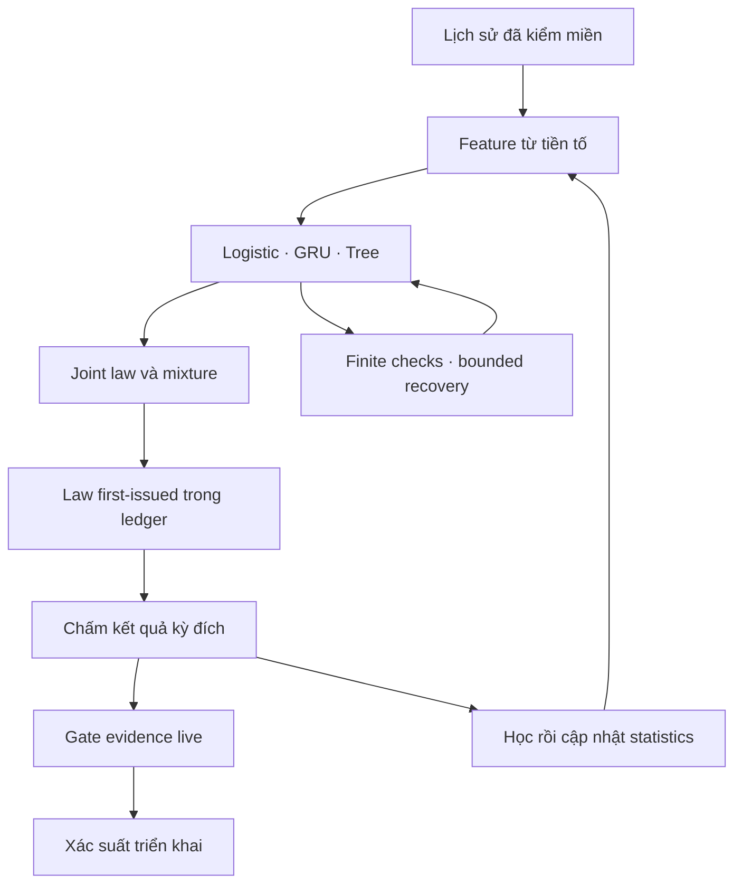

# Rà soát và phục hồi ML VLA — 09-10-2026

## Kết luận và phạm vi

Đã sửa các lỗi được tái hiện trong vòng đời model XSMB, runtime nghiên cứu, đặc trưng/ngữ cảnh Vietlott, checkpoint/ledger, kiểm định và đánh giá ngoài mẫu. Challenger chuẩn hóa nhân quả mặc định tắt: phép đánh giá 7 sản phẩm chưa cho thấy lợi thế có ý nghĩa thống kê. Refactor giúp trạng thái, số đo và phục hồi đáng tin hơn; không chứng minh tăng xác suất trúng.

Nền: `46aa9b53312c457bae21e5a6ee065facc712d4f2`. Kho này là hệ thống xổ số, không có Vision Encoder, LLM, CUDA/FSDP hay training đa phương thức. Giữ `src/` XSMB và `vietlott/` độc lập, schema/CLI đang dùng và sổ dự báo đã phát. Không tạo component không có caller để mô phỏng kiến trúc VLM.

[Thiết kế](../architecture/2026-10-09-adaptive-forecast-design.md) và [kế hoạch](../architecture/2026-10-09-adaptive-forecast-plan.md) nêu các hợp đồng. [Bản đồ import Python](2026-10-09-python-dependencies.json) chứa đường dẫn, hash, imports/relative imports và các catch rộng của toàn bộ file Python được theo dõi hoặc mới tạo. Toàn bộ 578 file được parse AST; phạm vi đọc từng dòng tập trung vào pipeline, feature, model, inference, loader, writer, ledger và callers liên quan. Đây không phải tuyên bố đã đọc thủ công mọi dòng hoặc chứng minh zero bugs.

## Audit Summary

| Nhóm lỗi xác thực | Cách khắc phục và hồi quy |
| --- | --- |
| Loader xóa incumbent trước retrain; serialize hỏng để lại pack một phần | `model_io.atomic_joblib_dump`: staging cùng thư mục, stream/flush/fsync/replace, dọn temp; giữ pack cũ nếu fit/ghi lỗi. Không unlink trước học. |
| Pack corrupt gây KeyError/UnpicklingError/lỗi codec nén thoát phục hồi | Danh sách exception đọc model cụ thể dùng chung, gồm zlib/lzma; fixture pack nén hỏng thật cho bốn loader. Log chỉ loại lỗi. |
| Online shadow làm Top LOTO tập trung một đuôi | Dùng một `diversified_order` chung cho Top4/8/10 và picks; giữ xác suất đã công bố. |
| Refit/predict lỗi phá model cũ hoặc gắn baseline dưới tên model lỗi | Staging fit, schema riêng từng arm, chỉ đưa arm khả dụng vào blend/reward; model failure đi vào safe mode. |
| Lỗi downstream chấm reward/tracker hai lần khi retry | Rollback bandit, tracker append, drift, safe-mode/cursor/RNG; giữ forecast đã phát. |
| Tổng trọng số hữu hạn quá lớn overflow | Normalize qua maximum trước sum; vector vẫn tổng 1. |
| NaN/Inf bị clip che, optimizer nhận trạng thái hỏng | Kiểm finite trước clip; loss/gradient/moments/params staged; GRU norm có scale; checkpoint counters/shape được kiểm. |
| Tree backend trả candidate NaN/invalid mà không raise | Kiểm arrays/topology RF và prediction của booster trên batch có chặn trước commit; giữ expert tốt và ghi training_skip. |
| Update nhiều component/partial batch có cursor/evidence/audit lệch | Commit theo draw; pending/law/live score cùng transaction; finally chốt hash và completeness metadata cho snapshot có phần đã commit. Retry không replay prefix. |
| Checkpoint có thành tích live bất khả thi hoặc không có ledger chứng minh | Kiểm counters/current/max/recent; service đối chiếu law first-issued, hash, schedule, actual result và scores. Không khớp thì xóa evidence phục hồi, giữ model nghiên cứu. |
| Pending checkpoint hữu hạn nhưng khác law đã phát vẫn được chấm trước đối soát | Phục hồi pending từ issue đầu tiên trước update, kiểm tiền tố/ngày/kỳ/law/thời điểm phát; thiếu hoặc hỏng issue thì không nhận điểm live. Dòng phát lặp không thay dòng đầu; zero-score không lấy nhầm lịch sử điểm. |
| PMI/cluster tạo hỗ trợ từ cặp chưa xuất hiện | Chỉ dùng co-occurrence dương; log-space tránh underflow; chuẩn hóa đối xứng; cluster chỉ chọn neighbor có pair-count dương. |
| Report/portfolio dùng ngày kỳ trước khi chưa issue | Resolver target ID/date/time chung; law pending đầu tiên được giữ; diagnostics và portfolio cùng context. FAST date-only không được xác nhận slot live. |
| Legacy không nhận diện sửa/backfill lịch sử | Prefix fingerprint, reset/replay weights/pending/evidence khi lịch sử đổi; checkpoint và score-ledger rewrite atomic. |
| GCN báo skill khi train range rỗng; catalogue che lỗi kho | Từ chối split thiếu train/validation/test; API yêu cầu đủ history. Catalogue chỉ bắt thiếu dữ liệu; lỗi quyền/corruption nổi lên. |
| Marginal 0/1 tạo odds/RTP NaN | Kiểm miền/simplex; co biên 1e-6 về k/n và nêu rõ xấp xỉ; prefix/suffix DP tránh triệt tiêu hệ số. |
| Calibration flatten các số trong một kỳ như độc lập | Ma trận dùng residual theo kỳ + HAC, giữ covariance. Guard roundoff cho luật công bằng; residual thật khác 0 vẫn bị phát hiện. |
| DM mẫu rỗng/ngắn, alpha kết luận không được truyền | Bounds rõ ràng, alpha được truyền qua per-number/changepoint; giữ default .05. |
| BH mất toàn bộ kết quả khi một p-value thiếu | Helper finite-aware chung và wrappers; chỉ tính số giả thuyết finite, vị trí thiếu giữ NaN. |
| Closure loop dùng giá trị vòng cuối; thẻ provenance lặp parser | Bind loop values; UI dùng canonical `weights_provenance`, giữ metadata legacy và chấp nhận days_used thiếu. |
| Benchmark có thể ghi đè baseline rồi tự so sánh | Reject output/compare cùng resolved path trước write; ghép đúng product alias/hash/ID/date/count. |

Dọn dependency: bỏ `seaborn` vì không có caller/import động và plot đã dùng Matplotlib. Không xóa module nghiên cứu `association_rules`, `candidate_scoring`, calculator công khai, CLI wrapper hay dữ liệu/archives có caller. Wilson có hợp đồng zero-trial/z khác nhau nên chưa gom bằng phép thay hàng loạt.

## Refactored Directory Tree

Giữ tên module thực tế và API hiện có; bảng dưới là cấu trúc đang dùng sau refactor.

| Thư mục/module | Trách nhiệm |
| --- | --- |
| `src/model_io.py` | Atomic model packs, exception đọc serialization/codec dùng chung. |
| `src/{ml_train,ml_predict,meta_predictor,cau_keo_ml,online_learning}.py` | Vòng đời model/dự đoán XSMB sản xuất. |
| `src/ml_engine/{models,main_pipeline,bandit,drift,fallback,metrics}.py` | Runtime nghiên cứu; transaction, availability, checkpoint và safe-mode. |
| `src/statistical_corrections.py` | BH-FDR finite-aware qua wrappers tương thích. |
| `vietlott/src/vlm/forecast/{features,models,distribution,pipeline}.py` | Feature nhân quả, experts, joint law, mixture/target/cursor. |
| `vietlott/src/vlm/forecast/{adaptation,recovery}.py` | Running mean/std, monitor drift mô tả, challenger chuẩn hóa, bounded retry/backoff/telemetry. |
| `vietlott/src/vlm/forecast/{service,api,cli,evaluation}.py` | Ledger reconciliation, adapter API/CLI, evaluator ngoài mẫu. |
| `vietlott/src/vietlott_engine/{forecast,ml_models,inference,api}/` | Legacy compatibility, graph/GCN, kiểm định, endpoint với bounds. |
| `vietlott/scripts/evaluate_adaptive.py` | Benchmark tái lập không collector/model/ledger production. |
| `tests/`, `vietlott/tests/` | Hồi quy bằng dữ liệu giả, tmp_path và fault injection; hai suite độc lập. |
| `documentation/evaluations/` | Trace từng kỳ, hashes/config/runtime và so sánh ghép cặp. |



## Full Refactored Code và vận hành

Mã đầy đủ nằm trong các module ở bảng trên, không có stub/TODO mới. Các phần recovery/adaptation/evaluation có type hints/docstrings; decorators chỉ phục hồi MemoryError/FloatingPointError đã xác định. Input sai shape/label hay lỗi lập trình vẫn raise; không đoán layout hoặc sửa nhãn tự động.

- Running statistics chỉ cập nhật sau score; normalize dùng mean/std quá khứ. Drift score là monitor mô tả, không phải p-value hay bằng chứng cải thiện.
- Prediction expert hỏng dùng fair law trước khi thấy kết quả; training numeric lỗi bỏ update riêng expert, backoff có sàn 1/32. Tree OOM thử lại tối đa một lần với nửa replay. Telemetry tối đa 32 event, replay theo config.
- Mặc định `MLConfig.adaptive=False` / settings `ml_adaptive=False`. CLI nghiên cứu có `--adaptive`, `--no-adaptive`; đổi cấu hình đã lưu cần `fit`. Old v2 checkpoint giữ parameters/law, monitor mới khởi tạo lạnh.
- Không thay threshold live, luật trust hay tự promote theo retrospective. Keno/Bingo lịch sử chỉ ngày không được chứng nhận live.

Tái lập từ thư mục `vietlott` sau cài dependency project:

```sh
PYTHONPATH=src python scripts/evaluate_adaptive.py --seed-dir data/seed --output /tmp/vietlott-default.json.gz --label repaired-default
PYTHONPATH=src python scripts/evaluate_adaptive.py --seed-dir data/seed --output /tmp/vietlott-adaptive.json.gz --label adaptive-challenger --adaptive --compare-with /tmp/vietlott-default.json.gz
```

Cấu hình: bootstrap600, warmup32, tree_every64, tree_buffer64, RF, seed20261003. Mỗi sản phẩm lấy 600 kỳ cuối của snapshot seed, 400 kỳ ban đầu/200 holdout, law tính trước update. Kỳ đích ID/date là điều kiện biết trước trong đánh giá hồi cứu; không issue; hai báo cáo mới ghi live_scored=0. Bản incumbent không lưu field này, protocol cũng không issue. Không tune config sau xem holdout.

## Kết quả ngoài mẫu

Log gain trung bình (nats/kỳ) so với fair; lớn hơn tốt hơn. Đây là điểm joint law, không phải tỷ lệ jackpot.

| Sản phẩm | Incumbent | Bản sửa mặc định | Adaptive |
| --- | ---: | ---: | ---: |
| mega645 | -0.00010642 | -0.00011780 | -0.00014417 |
| power655 | -0.00013841 | -0.00014295 | -0.00014314 |
| lotto535 | +0.00016258 | +0.00054303 | -0.00000940 |
| keno | -0.00065568 | -0.00063260 | -0.00070947 |
| bingo18 | -0.00033377 | -0.00033495 | -0.00032792 |
| max3d | -0.00279841 | -0.00279267 | -0.00240647 |
| max3dpro | -0.00168193 | -0.00168114 | -0.00167178 |

Không có sản phẩm thắng có ý nghĩa ở ngưỡng .05 sau BH-FDR. Adaptive so incumbent có q tối thiểu .6282; so bản sửa mặc định tối thiểu .7572; so fair .9201. CI HAC/DM ghép cặp và trace/hashes nằm trong [comparison JSON](../evaluations/2026-10-09-vietlott-comparison.json), [incumbent](../evaluations/2026-10-09-vietlott-incumbent.json.gz), [default](../evaluations/2026-10-09-vietlott-default.json.gz), [adaptive](../evaluations/2026-10-09-vietlott-adaptive.json.gz).

Brier là tổng mean squared marginal error của từng component; digit counts chuẩn hóa theo per_draw. Hits là overlap main-set Top-k, không phải giải thưởng; metric này không áp dụng digit-only. Mỗi comparison hiệu chỉnh họ 7 sản phẩm riêng, không hiệu chỉnh mọi cấu hình có thể đã thử trong lịch sử dự án. 200 kỳ/holdout, seed đến cuối09/đầu10, không có live prospective evidence: không thể suy ra lợi thế cược. Incumbent chạy bằng source copy đúng base commit; scorer của hai bản mới khớp các module final, có hash cùng config/package versions. Các hardening GCN/calibration không nằm trong scorer benchmark VLM.

## Kiểm chứng và giới hạn

Các lỗi mới được tái hiện RED trước fix và có pytest GREEN; dùng thư mục tạm/fault injection, không sửa model/ledger sản xuất. Đột biến cô lập đã bắt 25 nhóm root lifecycle, 14 nhóm recovery/evaluator; Task2 bổ sung 29 nhóm graph/context/legacy/inference (mỗi nhóm phải thất bại assertion, không tính collection errors). Review riêng Task1, Task2, Task3/4, evaluator và review toàn nhánh trước tích hợp. Finding pending cuối được tái hiện RED25, sửa với 28 fixtures, rồi review độc lập lại phạm vi sửa: 170 phép kiểm liên quan passed, không còn finding important/critical trong phạm vi.

Lệnh gates:

```sh
PYTHONPATH=src python -m pytest -q
python -m ruff check src tests scripts
cd vietlott
PYTHONPATH=src python -m pytest -q
python -m ruff check --select F,B023 src scripts tests
```

Bộ full root đã hoàn tất 3339 passed/9 skipped, 18 cảnh báo; hồi quy metadata legacy nằm trong lượt này. Sau sửa pending service cuối, 62 kiểm tra root tích hợp trang được chạy lại và passed; root source không đổi. Full engine trên source cuối: 571 passed/3 skipped, một Starlette warning. CI là gate bắt buộc trước merge. Skips môi trường: torch/xgboost/curl_cffi hoặc CLI tùy chọn và browser theo điều kiện test; không gọi các nhánh bỏ qua là đã chạy. Cảnh báo SHAP, pandas fragmentation, pydantic NumPy bool và Starlette được giữ rõ trong logs.

Dựng thử đủ 8 trang Vietlott bằng dữ liệu đã commit thành công, không ghi vào model/ledger thật. Chromium đạt 64 trạng thái trang ở bốn chiều rộng, sáng/tối, thao tác đối chiếu và bộ số nháp. Cache model cục bộ thiếu một phần so với bản công bố nên không đưa các HTML snapshot này vào commit; workflow trên main dựng lại từ cache engine thực tế. Các benchmark dùng seed cố định, tách với dữ liệu kết quả mới hơn của trang.

Đường dữ liệu/đồ họa đang chạy vẫn cần cân nhắc refactor riêng với fixture: legacy Excel/heatmap overlay trong statistical_matrices và một số Wilson helpers có hợp đồng khác nhau. Không đủ căn cứ gọi chúng là dead code hoặc xóa file. Không benchmark GPU/OOM CUDA vì repository không có pipeline CUDA; không khẳng định không còn memory leak/race condition ở mọi deployment. Các giới hạn dữ liệu/crawler hiện có không được giải quyết bằng thay thuật toán.

## Quyết định thiết kế và khả năng hoàn tác

- Giữ kiến trúc xổ số thực tế, không thêm scaffold VLM/GPU: nếu sau này có pipeline đa phương thức, cần thiết kế riêng.
- Helper atomic model tách khỏi atomic_io sau import-closure gate phát hiện joblib kéo vào verifier trang: caller pack giữ nguyên, tránh tăng dependency job nhẹ.
- Học thích nghi opt-in, không promote: có thể bỏ lỡ lợi thế thật chưa đủ lực kiểm định; bù lại không triển khai lợi thế chưa chứng minh.
- Phục hồi hữu hạn và nguyên tử, không sửa input tùy đoán: lỗi không thuộc contract cần được người vận hành sửa rõ ràng.
- Gom helpers có cùng contract, giữ Wilson/export có contract khác: còn code tương tự nhưng tránh đổi đầu ra ngầm.
- Mở rộng phạm vi cho các lỗi biên/ledger/calibration đã tái hiện; giữ kiểm thử và review riêng để kiểm soát regression.
- Thực hiện trên branch riêng rồi CI/merge main theo ủy quyền đã có; không force-push, không xóa worktree/trạng thái công việc có sẵn.
